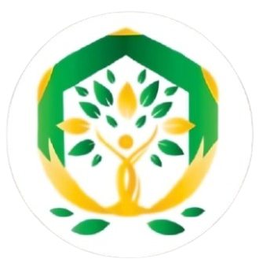
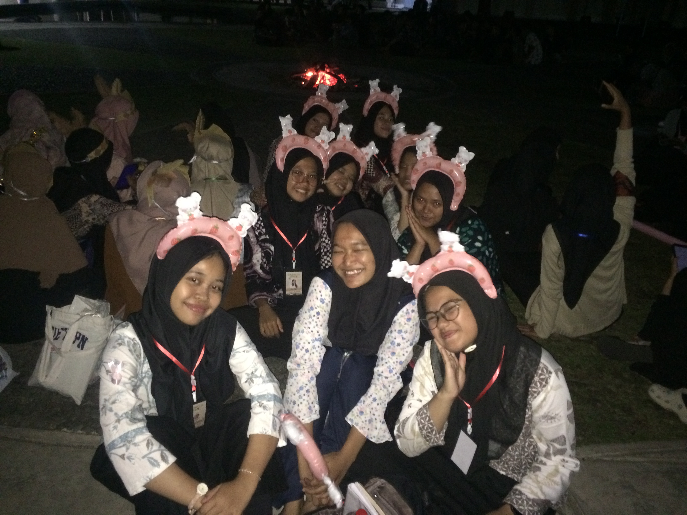
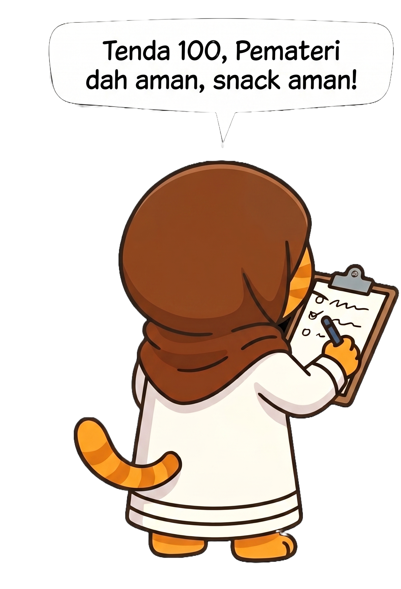
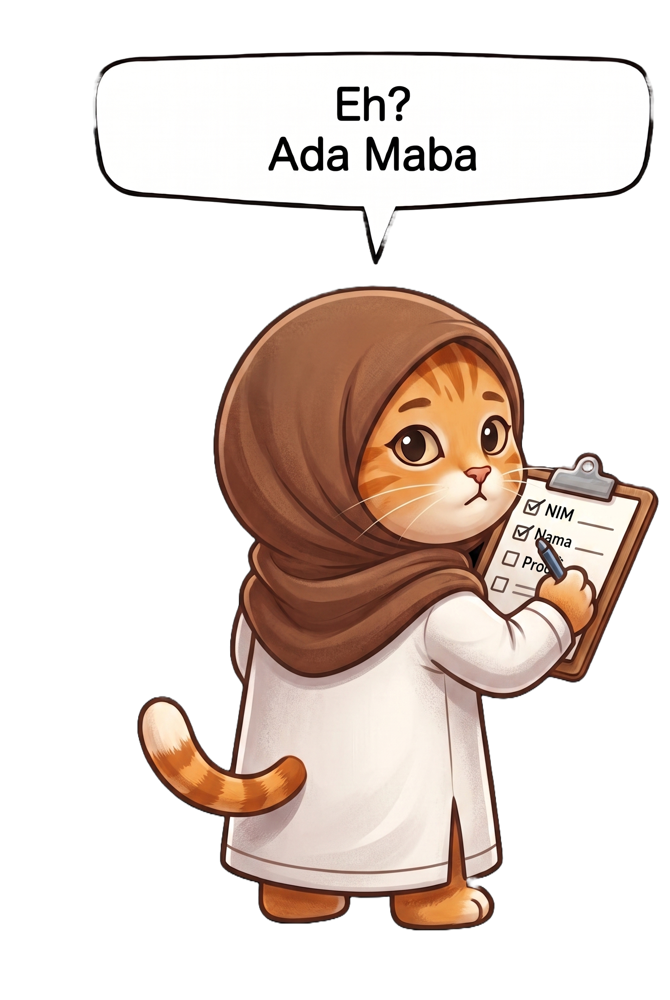
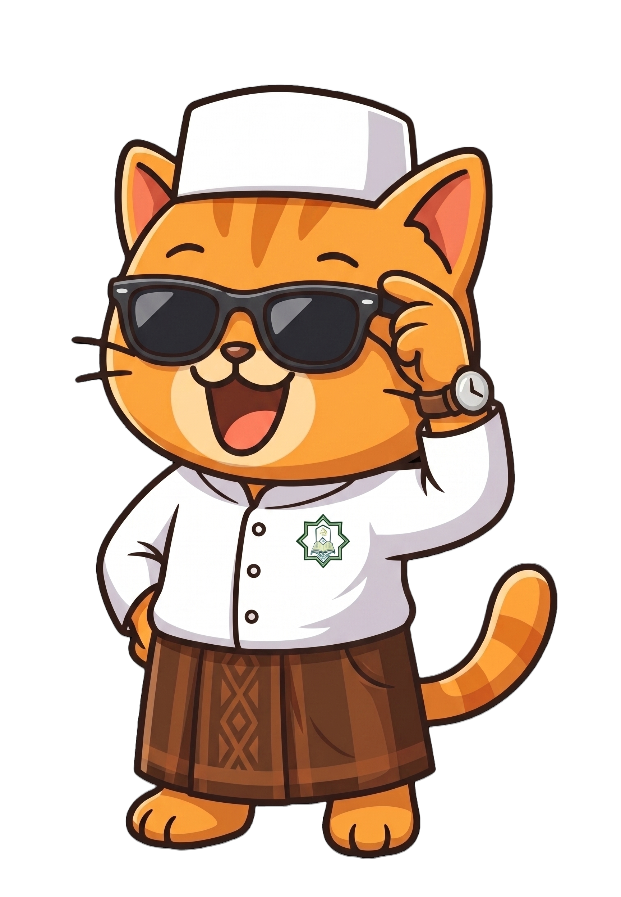
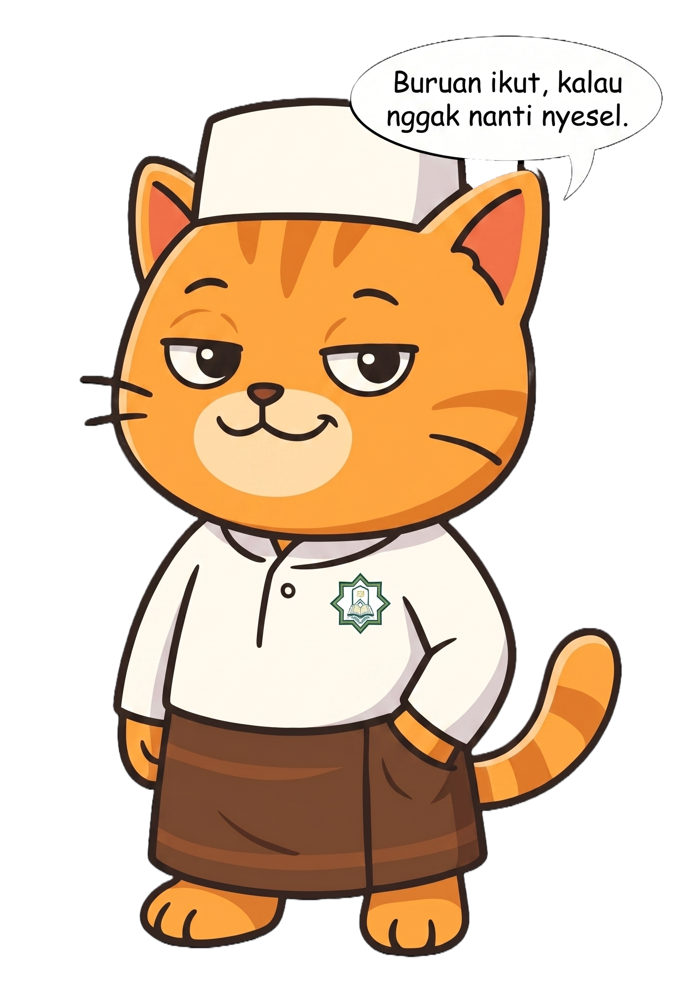

<!DOCTYPE html>
<html lang="id">
<head>
<meta charset="UTF-8">
<meta name="viewport" content="width=device-width, initial-scale=1.0">
<title>EKS-MILD 2026 — Ekspedisi Mengenal Islam Lebih Dekat</title>
<meta name="description" content="Ekspedisi Mengenal Islam Lebih Dekat 2026. Camping keakraban Maba FV UNY, 12-13 September 2026. Lokasi & harga segera diumumkan!">
<meta name="theme-color" content="#0D2438">

<!-- Favicon — pakai logo asli EKS-MILD. Kalau file belum ke-load browser bakal fallback ke tab kosong,
     jadi pastiin logo_eks-mild.png ada satu folder sama file HTML ini pas di-deploy. -->
<link rel="icon" type="image/png" href="logo_eks-mild.png">

<!-- ═══ SOCIAL PREVIEW (Open Graph / Twitter) ═══
     Ini yang muncul kalau link di-share ke grup WA/IG — sering jadi
     "first impression" pertama sebelum orang sempat buka webnya.
     GANTI og:url & og:image ke domain final sebelum go-live
     (og:image butuh URL absolut, bukan path relatif). -->
<meta property="og:type" content="website">
<meta property="og:locale" content="id_ID">
<meta property="og:site_name" content="UKMf KM Baiturrahman">
<meta property="og:url" content="https://GANTI-DOMAIN-KAMU.com/">
<meta property="og:title" content="EKS-MILD 2026 — Ekspedisi Mengenal Islam Lebih Dekat">
<meta property="og:description" content="Camping keakraban Maba FV UNY di destinasi alam yang masih dirahasiakan. 12–13 September 2026. Pendaftaran dibuka 1 Agustus 2026.">
<meta property="og:image" content="https://GANTI-DOMAIN-KAMU.com/GANTI-gambar-share.jpg">
<meta property="og:image:width" content="1200">
<meta property="og:image:height" content="630">
<meta name="twitter:card" content="summary_large_image">
<meta name="twitter:title" content="EKS-MILD 2026 — Ekspedisi Mengenal Islam Lebih Dekat">
<meta name="twitter:description" content="Camping keakraban Maba FV UNY di destinasi alam yang masih dirahasiakan. 12–13 September 2026.">
<meta name="twitter:image" content="https://GANTI-DOMAIN-KAMU.com/GANTI-gambar-share.jpg">

<link rel="preconnect" href="https://fonts.googleapis.com">
<link rel="preconnect" href="https://fonts.gstatic.com" crossorigin>
<link href="https://fonts.googleapis.com/css2?family=Kanit:ital,wght@0,200;0,300;0,400;0,500;0,600;0,700;0,800;0,900;1,700;1,900&display=swap" rel="stylesheet">

<!-- Data terstruktur event — bantu Google nampilin rich snippet (tanggal/lokasi) -->

<style>
/* ══════════════════════════════════════════════════════
   TOKENS
══════════════════════════════════════════════════════ */
:root {
  --ease-out:    cubic-bezier(0.23, 1, 0.32, 1);
  --ease-in-out: cubic-bezier(0.77, 0, 0.175, 1);
  --ease-spring: cubic-bezier(0.32, 0.72, 0, 1);
  --ease-snap:   cubic-bezier(0.16, 1, 0.3, 1);

  --bg:          #EEE5BC;
  --bg-lift:     #F8F3E3;
  --surface:     rgba(66,137,203,0.05);
  --border:      rgba(66,137,203,0.14);
  --text:        #0D2438;
  --text-muted:  rgba(13,36,56,0.6);
  --text-dim:    rgba(13,36,56,0.32);
  --accent-fire: #4289CB;
  --accent-mag:  #7DAEDA;
  --accent-warm: #B8D2E9;
  --accent-clay: #EEE5BC;

  /* Nav pill selalu berlatar gelap terlepas dari tema halaman —
     jadi dia butuh set warna teks sendiri yang terang, BUKAN
     --text-muted (yang gelap, untuk latar terang). Ini yang
     memperbaiki tulisan navbar yang nyaris tak terlihat. */
  --nav-text:        rgba(248,243,227,0.92);
  --nav-text-muted:  rgba(248,243,227,0.62);
  --nav-border:      rgba(248,243,227,0.14);
  --nav-divider:     rgba(248,243,227,0.16);

  --z-bg:        -1;
  --z-content:    1;
  --z-sticky:    10;
  --z-float:     20;
  --z-drawer:   400;
  --z-pill:     450;
  --z-nav:      500;
  --z-loader:  9999;
}

/* ══════════════════════════════════════════════════════
   RESET
══════════════════════════════════════════════════════ */
*, *::before, *::after { box-sizing: border-box; margin: 0; padding: 0; }
html { scroll-behavior: auto; }
body {
  font-family: 'Kanit', sans-serif;
  background: var(--bg);
  color: var(--text);
  -webkit-font-smoothing: antialiased;
  -moz-osx-font-smoothing: grayscale;
  overflow-x: hidden;
}
a { color: inherit; text-decoration: none; }
button { cursor: pointer; border: none; background: none; font: inherit; color: inherit; }
img { display: block; max-width: 100%; }

/* ── FOCUS VISIBLE — cincin aksen biru, kontras di section terang maupun gelap ── */
a:focus-visible,
button:focus-visible,
[tabindex]:focus-visible,
input:focus-visible {
  outline: 2.5px solid var(--accent-fire);
  outline-offset: 3px;
}

/* ══════════════════════════════════════════════════════
   LOADER — CINEMATIC
══════════════════════════════════════════════════════ */
#loader {
  position: fixed; inset: 0;
  background: #040404;
  z-index: var(--z-loader);
  display: flex; align-items: center; justify-content: center;
  flex-direction: column;
  overflow: hidden;
  cursor: none;
}

/* ── Canvas partikel ── */
#loader-canvas {
  position: absolute; inset: 0;
  width: 100%; height: 100%;
  pointer-events: none;
}

/* ── Scanline overlay ── */
#loader::before {
  content: '';
  position: absolute; inset: 0;
  background: repeating-linear-gradient(
    0deg,
    transparent,
    transparent 2px,
    rgba(0,0,0,0.08) 2px,
    rgba(0,0,0,0.08) 4px
  );
  pointer-events: none;
  z-index: 1;
  animation: scanlines-flicker 0.18s steps(1) infinite;
}
@keyframes scanlines-flicker {
  0%, 90% { opacity: 1; }
  91%, 100% { opacity: 0.85; }
}

/* ── Vignette ── */
#loader::after {
  content: '';
  position: absolute; inset: 0;
  background: radial-gradient(ellipse 80% 80% at 50% 50%, transparent 40%, rgba(0,0,0,0.75) 100%);
  pointer-events: none; z-index: 1;
}

/* ── BARA title ── */
.loader-center {
  position: relative; z-index: 2;
  display: flex; flex-direction: column;
  align-items: center;
  gap: 0;
}

.loader-eyebrow {
  font-size: clamp(0.55rem, 1.2vw, 0.7rem);
  font-weight: 300;
  letter-spacing: 0.52em;
  text-transform: uppercase;
  color: rgba(215, 226, 234, 0.322);
  margin-bottom: 18px;
  opacity: 0;
  animation: ld-fade-up 0.6s var(--ease-out) 0.3s forwards;
}

.loader-big {
  font-size: clamp(5rem, 18vw, 14rem);
  font-weight: 900;
  font-style: italic;
  text-transform: uppercase;
  letter-spacing: -0.05em;
  line-height: 0.85;
  position: relative;
  opacity: 0;
  /* Glitch clip planes */
  animation: ld-title-in 0.5s var(--ease-snap) 0.5s forwards;
}
/* gradient text */
.loader-big-inner {
  display: block;
  background: linear-gradient(
    158deg,
    #4289CB 0%,
    #DCE7F2 28%,
    #FFFFFF 45%,
    #7DAEDA 65%,
    #B8D2E9 82%,
    #DCE7F2 100%
  );
  background-size: 200% 200%;
  -webkit-background-clip: text;
  -webkit-text-fill-color: transparent;
  background-clip: text;
  animation: ld-shimmer 3.5s linear 1.2s infinite;
}
@keyframes ld-shimmer {
  0%   { background-position: 200% 0; }
  100% { background-position: -200% 0; }
}

/* Glitch layers */
.loader-big::before,
.loader-big::after {
  content: 'BARA';
  position: absolute; inset: 0;
  font-size: inherit;
  font-weight: inherit;
  font-style: inherit;
  letter-spacing: inherit;
  line-height: inherit;
  -webkit-background-clip: text;
  background-clip: text;
  -webkit-text-fill-color: transparent;
  opacity: 0;
  pointer-events: none;
}
.loader-big::before {
  background: #4289CB;
  animation: glitch-1 4s steps(1) 1.4s infinite;
  clip-path: inset(30% 0 50% 0);
}
.loader-big::after {
  background: #7DAEDA;
  animation: glitch-2 4s steps(1) 1.7s infinite;
  clip-path: inset(60% 0 20% 0);
}
@keyframes glitch-1 {
  0%, 94%, 100% { opacity: 0; transform: none; }
  95% { opacity: 0.7; transform: translateX(-4px) skewX(-1deg); }
  96% { opacity: 0.5; transform: translateX(3px); }
  97% { opacity: 0; }
}
@keyframes glitch-2 {
  0%, 96%, 100% { opacity: 0; transform: none; }
  97% { opacity: 0.6; transform: translateX(5px) skewX(2deg); }
  98% { opacity: 0.3; transform: translateX(-2px); }
  99% { opacity: 0; }
}

@keyframes ld-title-in {
  0%   { opacity: 0; transform: scale(1.1) translateY(10px); filter: blur(20px); }
  60%  { opacity: 1; filter: blur(0px); }
  100% { opacity: 1; transform: scale(1) translateY(0); }
}

/* ── Sub-tagline ── */
.loader-tagline {
  font-size: clamp(0.58rem, 1.1vw, 0.72rem);
  font-weight: 300;
  letter-spacing: 0.38em;
  text-transform: uppercase;
  color: rgba(215,226,234,0.45);
  margin-top: 20px;
  opacity: 0;
  animation: ld-fade-up 0.7s var(--ease-out) 1.0s forwards;
}
@keyframes ld-fade-up {
  from { opacity: 0; transform: translateY(10px); }
  to   { opacity: 1; transform: translateY(0); }
}

/* ── Progress bar area ── */
.loader-progress-wrap {
  position: relative; z-index: 2;
  margin-top: 52px;
  width: clamp(200px, 40vw, 360px);
  display: flex; flex-direction: column; gap: 10px;
  opacity: 0;
  animation: ld-fade-up 0.5s var(--ease-out) 0.8s forwards;
}
.loader-progress-track {
  width: 100%; height: 1.5px;
  background: rgba(215,226,234,0.08);
  border-radius: 2px;
  overflow: hidden;
  position: relative;
}
.loader-progress-fill {
  height: 100%; width: 0%;
  border-radius: 2px;
  background: linear-gradient(90deg, #4289CB, #7DAEDA, #B8D2E9, #DCE7F2);
  background-size: 200% 100%;
  transition: width 0.18s linear;
  animation: ld-bar-shimmer 2s linear infinite;
  position: relative;
}
.loader-progress-fill::after {
  content: '';
  position: absolute; right: 0; top: 50%;
  transform: translateY(-50%);
  width: 6px; height: 6px; border-radius: 50%;
  background: #fff;
  box-shadow: 0 0 10px 3px rgba(255,255,255,0.6), 0 0 24px 6px rgba(66,137,203,0.5);
}
@keyframes ld-bar-shimmer {
  0%   { background-position: 200% 0; }
  100% { background-position: -200% 0; }
}

.loader-progress-row {
  display: flex; justify-content: space-between; align-items: center;
}
.loader-progress-status {
  font-size: 0.56rem; letter-spacing: 0.24em;
  text-transform: uppercase; color: rgba(215,226,234,0.3);
  font-weight: 300;
  transition: opacity 0.3s;
}
.loader-progress-pct {
  font-size: 0.58rem; font-weight: 700;
  letter-spacing: 0.06em;
  color: rgba(215,226,234,0.5);
  font-variant-numeric: tabular-nums;
}

/* ── Corner coords (film feel) ── */
.loader-corner {
  position: absolute; z-index: 2;
  font-size: 0.48rem; letter-spacing: 0.16em;
  text-transform: uppercase; color: rgba(215,226,234,0.18);
  font-weight: 300;
  opacity: 0;
  animation: ld-fade-up 0.5s var(--ease-out) 1.1s forwards;
  pointer-events: none;
}
.loader-corner.tl { top: 28px; left: 32px; }
.loader-corner.tr { top: 28px; right: 32px; text-align: right; }
.loader-corner.bl { bottom: 28px; left: 32px; }
.loader-corner.br { bottom: 28px; right: 32px; text-align: right; }

/* ── Exit animation ── */
#loader.exit {
  animation: loader-exit 0.8s var(--ease-in-out) forwards;
}
@keyframes loader-exit {
  0%   { opacity: 1; transform: scale(1); }
  40%  { opacity: 1; transform: scale(1.04); }
  100% { opacity: 0; transform: scale(0.96); pointer-events: none; }
}

/* ══════════════════════════════════════════════════════
   PROGRESS BAR
══════════════════════════════════════════════════════ */
#progress-bar {
  position: fixed; top: 0; left: 0;
  height: 1.5px; width: 0%;
  background: linear-gradient(90deg, var(--accent-fire), var(--accent-mag), var(--accent-warm));
  z-index: calc(var(--z-nav) + 10);
  transition: width 0.08s linear;
}

/* ══════════════════════════════════════════════════════
   DYNAMIC ISLAND NAV — SHARED BASE
   Keduanya (desktop & mobile) pakai struktur yang sama
══════════════════════════════════════════════════════ */

/* ── Desktop DI ── */
#nav {
  position: fixed;
  top: 16px; left: 50%;
  transform: translateX(-50%) translateY(-120px);
  z-index: var(--z-nav);
  display: flex; align-items: center;
  background: rgba(9,9,9,0.90);
  backdrop-filter: blur(28px) saturate(1.6);
  -webkit-backdrop-filter: blur(28px) saturate(1.6);
  border: 1px solid var(--nav-border);
  border-radius: 100px;
  padding: 6px 8px;
  gap: 0;
  white-space: nowrap;
  box-shadow: 0 16px 48px rgba(0,0,0,0.65), 0 0 0 1px rgba(248,243,227,0.05) inset;
  transition:
    transform 680ms var(--ease-spring),
    opacity 400ms var(--ease-out),
    max-width 620ms var(--ease-spring),
    padding 560ms var(--ease-spring);
  opacity: 0;
  overflow: hidden;
  max-width: 100px;
  cursor: pointer;
}
#nav::before {
  content: '';
  position: absolute; top: 0; left: 15%; right: 15%; height: 1px;
  background: linear-gradient(90deg, transparent, var(--nav-divider), transparent);
  pointer-events: none;
}
#nav.di-visible {
  transform: translateX(-50%) translateY(0);
  opacity: 1;
}
#nav.di-expanded {
  max-width: 800px;
  padding: 6px 12px 6px 8px;
  cursor: default;
}

/* ── Mobile DI ── */
#nav-mobile {
  display: none;
  position: fixed;
  top: 14px; left: 50%;
  transform: translateX(-50%) translateY(-90px);
  z-index: var(--z-nav);
  align-items: center;
  /* Sama seperti desktop: overflow:hidden, max-width kecil awal */
  background: rgba(9,9,9,0.90);
  backdrop-filter: blur(28px) saturate(1.6);
  -webkit-backdrop-filter: blur(28px) saturate(1.6);
  border: 1px solid var(--nav-border);
  border-radius: 100px;
  padding: 6px 8px;
  gap: 0;
  white-space: nowrap;
  box-shadow: 0 16px 48px rgba(0,0,0,0.65), 0 0 0 1px rgba(248,243,227,0.05) inset;
  /* ← SAMA PERSIS dengan desktop: max-width + padding morph */
  transition:
    transform 680ms var(--ease-spring),
    opacity 400ms var(--ease-out),
    max-width 620ms var(--ease-spring),
    padding 560ms var(--ease-spring);
  opacity: 0;
  overflow: hidden;
  max-width: 100px; /* collapsed = hanya logo */
  cursor: pointer;
}
#nav-mobile::before {
  content: '';
  position: absolute; top: 0; left: 15%; right: 15%; height: 1px;
  background: linear-gradient(90deg, transparent, var(--nav-divider), transparent);
  pointer-events: none;
}
#nav-mobile.di-visible {
  transform: translateX(-50%) translateY(0);
  opacity: 1;
}
#nav-mobile.di-expanded {
  /* beri ruang penuh — konten di dalamnya yang mengatur ukurannya */
  max-width: calc(100vw - 16px);
  padding: 6px 6px 6px 6px;
  cursor: default;
}

/* ── Shared logo pair ── */
.nav-logo {
  display: flex; align-items: center; gap: 8px;
  flex-shrink: 0;
}
.nav-logo-img {
  width: 34px; height: 34px;
  border-radius: 50px;
  background: rgba(248,243,227,0.08);
  border: 1px solid var(--nav-border);
  display: flex; align-items: center; justify-content: center;
  overflow: hidden;
  transition: border-color 200ms var(--ease-out);
  flex-shrink: 0;
}
#nav-mobile .nav-logo { gap: 4px; }
#nav-mobile .nav-logo-img { width: 26px; height: 26px; }
@media (hover: hover) and (pointer: fine) {
  .nav-logo-img:hover { border-color: rgba(248,243,227,0.35); }
}
.nav-logo-img img { width: 100%; height: 100%; object-fit: cover; border-radius: 50px; }
.nav-logo-sep {
  width: 1px; height: 18px;
  background: var(--nav-divider);
  flex-shrink: 0;
}

/* ── Expandable content (desktop) ── */
.nav-content {
  display: flex; align-items: center;
  overflow: hidden;
  max-width: 0; opacity: 0;
  transition:
    max-width 600ms var(--ease-spring),
    opacity 380ms var(--ease-out),
    padding 560ms var(--ease-spring);
  padding-left: 0;
}
#nav.di-expanded .nav-content {
  max-width: 680px; opacity: 1;
  padding-left: 16px;
}

/* ── Expandable content (mobile) — IDENTIK dengan desktop ── */
.mnav-content {
  display: flex; align-items: center;
  overflow: hidden;
  max-width: 0; opacity: 0;
  transition:
    max-width 600ms var(--ease-spring),
    opacity 380ms var(--ease-out),
    padding 560ms var(--ease-spring);
  padding-left: 0;
}
#nav-mobile.di-expanded .mnav-content {
  /* biarkan konten menentukan lebarnya sendiri, nav sudah ada max-width */
  max-width: 9999px;
  opacity: 1;
  padding-left: 6px;
}

/* ── Shared nav links ── */
.nav-links {
  display: flex; align-items: center; gap: 20px; list-style: none;
}
.nav-links a {
  font-size: 0.7rem; font-weight: 400;
  color: var(--nav-text-muted); text-transform: uppercase; letter-spacing: 0.1em;
  transition: color 150ms var(--ease-out); white-space: nowrap;
}
@media (hover: hover) and (pointer: fine) {
  .nav-links a:hover { color: var(--nav-text); }
}

/* desktop links slightly larger gap */
#nav .nav-links { gap: 28px; }
/* mobile links: dirapatkan biar seluruh nav (termasuk CTA) muat, gak kepotong */
#nav-mobile .nav-links { gap: 5px; }
#nav-mobile .nav-links a { font-size: 0.5rem; letter-spacing: 0; }
/* divider mobile lebih rapat */
#nav-mobile .nav-di-divider { margin: 0 3px; }

.nav-di-divider {
  width: 1px; height: 18px;
  background: var(--nav-divider);
  flex-shrink: 0; margin: 0 10px;
}

/* CTA mungil di dalam DI mobile */
.nav-cta-mini {
  background: linear-gradient(118deg, #081522 0%, #4289CB 35%, #B8D2E9 68%, #7DAEDA 100%);
  box-shadow: 0 2px 12px rgba(66,137,203,0.3);
  outline: 1px solid rgba(255,255,255,0.12);
  outline-offset: -1px;
  border-radius: 9999px;
  color: white;
  text-shadow: 0 1px 4px rgba(8,21,34,0.45);
  padding: 6px 12px;
  text-transform: uppercase;
  letter-spacing: 0.06em;
  font-size: 0.55rem; font-weight: 700;
  display: inline-block;
  text-align: center;
  white-space: nowrap;
  flex-shrink: 0;
  transition: transform 160ms var(--ease-out), box-shadow 160ms var(--ease-out);
}
@media (hover: hover) and (pointer: fine) {
  .nav-cta-mini:not(.cta-locked):hover {
    transform: translateY(-1px);
    box-shadow: 0 4px 18px rgba(66,137,203,0.45);
  }
}
.nav-cta-mini:not(.cta-locked):active { transform: scale(0.95); }
/* CTA lebih ringkas di mobile — biar gak kepotong overflow nav */
#nav-mobile .nav-cta-mini {
  padding: 5px 7px;
  font-size: 0.47rem;
  letter-spacing: 0.01em;
}

/* Hide burger — tidak ada drawer mode lagi */
.nav-burger { display: none !important; }
.mnav-burger { display: none !important; }

/* ── Nav drawer — tetap ada untuk hero burger mobile ── */
.nav-drawer {
  position: fixed;
  top: 68px; left: 50%;
  transform: translateX(-50%) translateY(-16px);
  width: calc(100% - 32px); max-width: 340px;
  background: rgba(9,9,9,0.97);
  backdrop-filter: blur(24px);
  border: 1px solid var(--border);
  border-radius: 20px;
  padding: 8px 16px 14px;
  display: flex; flex-direction: column; gap: 0;
  z-index: var(--z-drawer);
  opacity: 0; pointer-events: none;
  transition: opacity 300ms var(--ease-out), transform 380ms var(--ease-spring);
}
.nav-drawer.open {
  transform: translateX(-50%) translateY(0);
  opacity: 1; pointer-events: auto;
}
.nav-drawer a {
  font-size: 0.95rem; font-weight: 500; color: var(--nav-text-muted);
  text-transform: uppercase; letter-spacing: 0.06em;
  padding: 11px 8px; border-bottom: 1px solid var(--nav-border);
  transition: color 150ms var(--ease-out), transform 200ms var(--ease-out);
  display: block;
}
@media (hover: hover) and (pointer: fine) {
  .nav-drawer a:hover { color: var(--nav-text); transform: translateX(4px); }
}
.nav-drawer a:last-child { border-bottom: none; margin-top: 8px; }

/* ══════════════════════════════════════════════════════
   HERO SECTION
══════════════════════════════════════════════════════ */
#hero {
  height: 100svh;
  min-height: 600px;
  display: grid;
  grid-template-rows: auto 1fr auto;
  overflow: hidden;
  position: relative;
  background: #0D2438;
  --text:       #F8F3E3;
  --text-muted: rgba(248,243,227,0.68);
  --text-dim:   rgba(248,243,227,0.4);
}

/* ── Hero background image layer ── */
.hero-bg-img {
  position: absolute; inset: 0;
  z-index: 0;
  overflow: hidden;
  pointer-events: none;
}
.hero-bg-img img {
  width: 100%; height: 100%;
  object-fit: cover;
  object-position: center center;
  display: block;
}
/* Dark overlay agar teks tetap terbaca */
.hero-bg-img::after {
  content: '';
  position: absolute; inset: 0;
  background: linear-gradient(
    to bottom,
    rgba(9,9,9,0.55) 0%,
    rgba(9,9,9,0.35) 40%,
    rgba(9,9,9,0.70) 80%,
    rgba(9,9,9,0.88) 100%
  );
}
/* Foto portrait untuk mobile — sembunyikan di desktop */
.hero-bg-mobile { display: none; }

@media (max-width: 768px) {
  .hero-bg-desktop { display: none; }
  .hero-bg-mobile  { display: block; }
}

#hero::after {
  content: '';
  position: absolute; inset: 0;
  background-image: url("data:image/svg+xml,%3Csvg viewBox='0 0 256 256' xmlns='http://www.w3.org/2000/svg'%3E%3Cfilter id='n'%3E%3CfeTurbulence type='fractalNoise' baseFrequency='0.9' numOctaves='4' stitchTiles='stitch'/%3E%3C/filter%3E%3Crect width='100%25' height='100%25' filter='url(%23n)' opacity='0.04'/%3E%3C/svg%3E");
  pointer-events: none; z-index: var(--z-content);
  mix-blend-mode: overlay;
}
.hero-glow-fire {
  position: absolute;
  width: 700px; height: 700px; border-radius: 50%;
  background: radial-gradient(ellipse, rgba(66,137,203,0.09) 0%, transparent 65%);
  bottom: -200px; right: -150px;
  pointer-events: none; z-index: var(--z-bg);
  animation: glow-pulse 8s var(--ease-in-out) infinite alternate;
}
.hero-glow-mag {
  position: absolute;
  width: 500px; height: 500px; border-radius: 50%;
  background: radial-gradient(ellipse, rgba(66,137,203,0.09) 0%, transparent 65%);
  top: -100px; left: -100px;
  pointer-events: none; z-index: var(--z-bg);
  animation: glow-pulse 11s var(--ease-in-out) infinite alternate-reverse;
}
@keyframes glow-pulse {
  from { transform: scale(1) rotate(0deg); opacity: 0.7; }
  to   { transform: scale(1.2) rotate(15deg); opacity: 1; }
}
.hero-grid {
  position: absolute; inset: 0;
  background-image:
    linear-gradient(rgba(248,243,227,0.025) 1px, transparent 1px),
    linear-gradient(90deg, rgba(248,243,227,0.025) 1px, transparent 1px);
  background-size: 72px 72px;
  pointer-events: none; z-index: var(--z-bg);
  mask-image: radial-gradient(ellipse 80% 80% at 50% 50%, black 30%, transparent 100%);
}
.hero-nav {
  display: flex; align-items: center; justify-content: space-between;
  padding: 28px 36px;
  position: relative; z-index: var(--z-float);
}
.hero-nav-logo {
  display: flex; align-items: center; gap: 10px;
}
.hero-logo-img {
  width: 40px; height: 40px;
  border-radius: 50px;
  background: rgba(248,243,227,0.06);
  border: 1px solid rgba(248,243,227,0.12);
  display: flex; align-items: center; justify-content: center;
  overflow: hidden;
  transition: border-color 200ms var(--ease-out), background 200ms var(--ease-out);
}
@media (hover: hover) and (pointer: fine) {
  .hero-logo-img:hover { border-color: rgba(248,243,227,0.3); background: rgba(248,243,227,0.09); }
}
.hero-logo-img img { width: 100%; height: 100%; object-fit: cover; border-radius: 50%; }
.hero-logo-sep {
  width: 1px; height: 22px;
  background: rgba(248,243,227,0.14);
  flex-shrink: 0;
}
/* Teks wordmark di sebelah logo — sebelumnya tanpa color eksplisit jadi
   ikut warisan --text ROOT (gelap) alih-alih --text lokal hero (terang),
   karena custom property override #hero cuma kepakai kalau di-var()
   ulang di titik pemakaiannya. Makanya kelihatan nyaris tak kebaca. */
.hero-nav-wordmark {
  font-size: 0.85rem; font-weight: 600; letter-spacing: 0.02em;
  color: var(--text);
}
.hero-nav-links {
  display: flex; align-items: center; gap: 36px; list-style: none;
}
.hero-nav-links a {
  font-size: 0.72rem; font-weight: 400;
  color: var(--text-muted); text-transform: uppercase; letter-spacing: 0.12em;
  transition: color 150ms var(--ease-out);
}
@media (hover: hover) and (pointer: fine) {
  .hero-nav-links a:hover { color: var(--text); }
}
.hero-burger {
  display: none;
  flex-direction: column; gap: 5px; padding: 6px;
  cursor: pointer; background: none; border: none;
}
.hero-burger span {
  display: block; width: 20px; height: 1.5px;
  background: var(--text); border-radius: 1px;
  transition: transform 240ms var(--ease-spring), opacity 180ms var(--ease-out);
  transform-origin: center;
}
.hero-burger.open span:nth-child(1) { transform: translateY(6.5px) rotate(45deg); }
.hero-burger.open span:nth-child(2) { opacity: 0; transform: scaleX(0); }
.hero-burger.open span:nth-child(3) { transform: translateY(-6.5px) rotate(-45deg); }

.hero-center {
  position: relative; z-index: var(--z-content);
  display: flex; flex-direction: column;
  justify-content: flex-end;
  padding: 0 24px clamp(84px, 16vh, 170px) 28px;
  overflow: hidden;
}

/* Corner deco */
.hero-deco-tr {
  position: absolute;
  top: 88px; right: 36px;
  z-index: var(--z-float);
  display: flex; flex-direction: column; align-items: flex-end; gap: 10px;
  opacity: 0; transform: translateX(16px);
  will-change: opacity, transform;
}
.hero-deco-tr.revealed {
  animation: deco-in-r 0.7s var(--ease-out) 0.9s forwards;
}
@keyframes deco-in-r {
  to { opacity: 1; transform: translateX(0); }
}
.hero-deco-badge {
  background: rgba(9,9,9,0.78);
  backdrop-filter: blur(20px) saturate(1.5);
  -webkit-backdrop-filter: blur(20px) saturate(1.5);
  border: 1px solid rgba(248,243,227,0.14);
  border-radius: 18px;
  padding: 14px 18px;
  display: flex; align-items: center; gap: 12px;
  min-width: 170px;
  box-shadow: 0 12px 36px rgba(0,0,0,0.5), inset 0 1px 0 rgba(248,243,227,0.06);
}
.hero-deco-badge-logo {
  width: 36px; height: 36px; border-radius: 8px;
  background: rgba(248,243,227,0.06);
  border: 1px solid rgba(248,243,227,0.1);
  padding: 4px; flex-shrink: 0;
  display: flex; align-items: center; justify-content: center;
  overflow: hidden;
}
.hero-deco-badge-logo img { width: 100%; height: 100%; object-fit: contain; }
.hero-deco-badge-text { display: flex; flex-direction: column; gap: 2px; }
.hero-deco-badge-name {
  font-size: 0.72rem; font-weight: 700;
  color: var(--text); text-transform: uppercase; letter-spacing: 0.04em;
  line-height: 1.2;
}
.hero-deco-badge-sub {
  font-size: 0.58rem; font-weight: 300;
  color: var(--text-dim); text-transform: uppercase; letter-spacing: 0.1em;
}
.hero-deco-bl {
  position: absolute;
  bottom: 100px; left: 28px;
  z-index: var(--z-float);
  display: flex; flex-direction: column; gap: 8px;
  opacity: 0; transform: translateX(-16px);
  will-change: opacity, transform;
}
.hero-deco-bl.revealed {
  animation: deco-in-l 0.7s var(--ease-out) 1.0s forwards;
}
@keyframes deco-in-l {
  to { opacity: 1; transform: translateX(0); }
}
.hero-stat-pill {
  background: rgba(9,9,9,0.78);
  backdrop-filter: blur(20px) saturate(1.5);
  -webkit-backdrop-filter: blur(20px) saturate(1.5);
  border: 1px solid rgba(248,243,227,0.12);
  border-radius: 100px;
  padding: 8px 16px;
  display: flex; align-items: center; gap: 8px;
  width: fit-content;
  box-shadow: 0 8px 28px rgba(0,0,0,0.40), inset 0 1px 0 rgba(248,243,227,0.05);
}
.hero-stat-dot {
  width: 6px; height: 6px; border-radius: 50%;
  background: var(--accent-clay); flex-shrink: 0;
  animation: pulse-dot 2.4s var(--ease-in-out) infinite;
  box-shadow: 0 0 8px rgba(238,229,188,0.6);
}
.hero-stat-dot.blue { background: var(--accent-warm); animation-delay: 0.8s; box-shadow: 0 0 8px rgba(184,210,233,0.6); }
.hero-stat-text {
  font-size: 0.64rem; font-weight: 500;
  color: var(--text-muted); text-transform: uppercase; letter-spacing: 0.12em;
  white-space: nowrap;
}

@media (max-width: 768px) {
  .hero-deco-tr { display: none; }
  .hero-deco-bl { display: none; }
}

.hero-bara {
  font-size: clamp(2.5rem, 8vw, 7rem);
  font-weight: 1000; font-style: italic;
  text-transform: uppercase;
  letter-spacing: -0.06em;
  line-height: 0.82;
  clip-path: inset(0 0 100% 0);
  transform: translateY(20px);
  will-change: clip-path, transform;
  background: linear-gradient(160deg,
    rgba(66,137,203,0.6) 0%,
    #B8D2E9 40%,
    rgba(227,240,163,0.9) 70%,
    rgba(66,137,203,0.5) 100%
  );
  -webkit-background-clip: text;
  -webkit-text-fill-color: transparent;
  background-clip: text;
  user-select: none;
}
.hero-bara.revealed {
  animation: bara-reveal 1s var(--ease-snap) forwards;
}

/* Layar lebar tapi pendek (laptop kecil, browser landscape) —
   kecilkan judul & rapatkan jarak biar gak nabrak pill countdown */
@media (max-height: 700px) {
  .hero-bara { font-size: clamp(2rem, 6vw, 4.2rem); }
  .hero-center { padding-bottom: clamp(60px, 8vh, 120px); }
  .hero-cd-wrap { bottom: 18px; }
  .hero-tema { margin-top: 8px; gap: 6px; }
  .hero-tema .tema-sub { display: none; }
}
@keyframes bara-reveal {
  to { clip-path: inset(0 0 0% 0); transform: translateY(0); }
}
.hero-label {
  font-size: clamp(0.7rem, 1.2vw, 1rem); font-weight: 300;
  letter-spacing: 0.28em; text-transform: uppercase;
  color: var(--text-muted);
  margin-bottom: 10px;
  opacity: 0;
  transform: translateY(12px);
  will-change: opacity, transform;
}
.hero-label.revealed {
  animation: fade-up 0.7s var(--ease-out) 0.4s forwards;
}
@keyframes fade-up {
  to { opacity: 1; transform: translateY(0); }
}
.hero-tema {
  margin-top: clamp(14px, 2.4vw, 22px);
  display: flex;
  flex-direction: column;
  align-items: center;
  gap: clamp(10px, 1.6vw, 14px);
}
.hero-tema .tema-tag {
  display: inline-block;
  font-size: clamp(0.58rem, 1vw, 0.68rem);
  font-weight: 700;
  letter-spacing: 0.32em;
  text-transform: uppercase;
  padding: 5px 16px;
  border: 1px solid rgba(125,174,218,0.4);
  border-radius: 999px;
  color: rgba(199,228,175,0.85);
  background: rgba(66,137,203,0.08);
  transform: rotate(-2.5deg);
  opacity: 0;
  will-change: opacity, transform;
}
.hero-tema.revealed .tema-tag {
  animation: tema-tag-in 0.6s var(--ease-out) forwards;
}
@keyframes tema-tag-in {
  from { opacity: 0; transform: rotate(-2.5deg) translateY(10px) scale(0.9); }
  to   { opacity: 1; transform: rotate(-2.5deg) translateY(0) scale(1); }
}
.hero-tema .tema-main {
  margin: 0;
  display: flex;
  flex-wrap: wrap;
  justify-content: center;
  align-items: baseline;
  gap: 0.4em;
  font-size: clamp(1rem, 2.7vw, 1.55rem);
  font-weight: 800;
  font-style: italic;
  letter-spacing: 0.01em;
}
.hero-tema .tw {
  display: inline-block;
  background: linear-gradient(160deg,
    rgba(66,137,203,0.7) 0%,
    #B8D2E9 45%,
    rgba(227,240,163,0.95) 70%,
    rgba(66,137,203,0.6) 100%
  );
  -webkit-background-clip: text;
  -webkit-text-fill-color: transparent;
  background-clip: text;
  opacity: 0;
  transform: translateY(12px) rotate(-4deg);
  will-change: opacity, transform;
}
.hero-tema.revealed .tw {
  animation: tw-pop 0.55s var(--ease-snap) forwards;
  animation-delay: calc(0.18s + var(--i, 0) * 0.1s);
}
@keyframes tw-pop {
  to { opacity: 1; transform: translateY(0) rotate(0deg); }
}
.hero-tema .tema-dot {
  color: rgba(184,210,233,0.45);
  font-weight: 400;
  font-style: normal;
}
.hero-tema .tema-sub {
  margin: 0;
  max-width: min(90vw, 420px);
  text-align: center;
  font-size: clamp(0.72rem, 1.4vw, 0.88rem);
  font-weight: 300;
  font-style: italic;
  letter-spacing: 0.01em;
  color: var(--text-muted);
  opacity: 0;
  transform: translateY(8px);
  will-change: opacity, transform;
}
.hero-tema.revealed .tema-sub {
  animation: fade-up 0.6s var(--ease-out) 0.52s forwards;
}
.hero-bottom {
  position: relative; z-index: var(--z-float);
  display: flex; justify-content: space-between; align-items: flex-end;
  padding: 20px 28px 32px;
  opacity: 0; transform: translateY(16px);
  will-change: opacity, transform;
}
.hero-bottom.revealed {
  animation: fade-up 0.7s var(--ease-out) 0.65s forwards;
}
.hero-desc {
  color: var(--text-muted);
  font-weight: 300;
  font-size: clamp(0.72rem, 1.1vw, 0.95rem);
  text-transform: uppercase;
  letter-spacing: 0.06em;
  line-height: 1.75;
  max-width: 220px;
}
.hero-desc strong { color: var(--text); font-weight: 600; }

.hero-cd-wrap {
  position: absolute; left: 50%; bottom: 36px;
  transform: translateX(-50%);
  z-index: var(--z-float);
  display: flex; flex-direction: column; align-items: center; gap: 8px;
  transition: opacity 300ms var(--ease-out), transform 400ms var(--ease-spring);
}
/* mobile duplicate: sembunyikan di desktop */
.hero-cd-mobile { display: none; }
.hero-cd-label {
  font-size: 0.7rem; letter-spacing: 0.18em; text-transform: uppercase;
  color: #B8D2E9;
  font-weight: 700;
  text-align: center;
  padding: 6px 16px;
  background: linear-gradient(135deg, rgba(125,174,218,0.14) 0%, rgba(66,137,203,0.10) 100%);
  border: 1px solid rgba(125,174,218,0.32);
  border-radius: 100px;
  animation: cd-label-pulse 2s ease-in-out infinite alternate;
  box-shadow: 0 2px 14px rgba(66,137,203,0.10);
}
@keyframes cd-label-pulse {
  from { box-shadow: 0 0 0 0 rgba(125,174,218,0.0), 0 2px 14px rgba(66,137,203,0.10); }
  to   { box-shadow: 0 0 14px 4px rgba(125,174,218,0.22), 0 2px 14px rgba(66,137,203,0.15); }
}
/* Saat pendaftaran RESMI DITUTUP — badge nunggu (outline magenta) jadi badge sukses (isi biru), angka countdown disembunyikan */
.hero-cd-wrap.cd-open .hero-cd-row { display: none; }
.hero-cd-wrap.cd-open .hero-cd-label {
  color: #081522;
  background: linear-gradient(118deg, #4289CB, #7DAEDA);
  border-color: transparent;
  font-size: 0.85rem;
  padding: 10px 22px;
}
/* Saat pendaftaran SEDANG DIBUKA — label jadi biru solid tapi angka countdown TETAP tampil,
   sekarang menghitung mundur ke penutupan pendaftaran (8 Agustus) */
.hero-cd-wrap.cd-live .hero-cd-label {
  color: #081522;
  background: linear-gradient(118deg, #4289CB, #7DAEDA);
  border-color: transparent;
}
.hero-cd-row {
  display: flex; gap: 6px; align-items: center;
  padding: 8px;
  background: rgba(9,9,9,0.42);
  backdrop-filter: blur(20px) saturate(1.4);
  -webkit-backdrop-filter: blur(20px) saturate(1.4);
  border: 1px solid rgba(248,243,227,0.08);
  border-radius: 18px;
  box-shadow: 0 12px 40px rgba(0,0,0,0.45), inset 0 1px 0 rgba(248,243,227,0.06);
}
.hero-cd-block {
  display: flex; flex-direction: column; align-items: center;
  background: linear-gradient(180deg, rgba(248,243,227,0.06) 0%, rgba(248,243,227,0.02) 100%);
  border: 1px solid rgba(248,243,227,0.10);
  border-radius: 12px; padding: 12px 16px;
  min-width: 58px;
  position: relative;
  overflow: hidden;
}
.hero-cd-block::before {
  content: '';
  position: absolute; top: 0; left: 0; right: 0; height: 1px;
  background: linear-gradient(90deg, transparent, rgba(184,210,233,0.4), transparent);
}
.hero-cd-num {
  font-size: 1.65rem; font-weight: 800;
  letter-spacing: -0.04em; line-height: 1;
  background: linear-gradient(180deg, #EAF4FC 0%, #B8D2E9 60%, #7DAEDA 100%);
  -webkit-background-clip: text;
  -webkit-text-fill-color: transparent;
  background-clip: text;
  font-variant-numeric: tabular-nums;
  text-shadow: 0 0 24px rgba(184,210,233,0.25);
}
.hero-cd-unit {
  font-size: 0.46rem; text-transform: uppercase;
  letter-spacing: 0.18em; color: var(--text-dim); margin-top: 5px;
  font-weight: 500;
}
.hero-cd-sep {
  font-size: 1.3rem; font-weight: 800;
  color: rgba(184,210,233,0.4); margin-bottom: 10px; flex-shrink: 0;
}

/* CTA buttons */
.cta-fire {
  background: linear-gradient(118deg, #081522 0%, #4289CB 35%, #B8D2E9 68%, #7DAEDA 100%);
  box-shadow: 0 4px 28px rgba(66,137,203,0.35), inset 4px 0 20px rgba(184,210,233,0.3);
  outline: 1.5px solid rgba(255,255,255,0.15);
  outline-offset: -2px;
  border-radius: 9999px;
  color: white;
  text-shadow: 0 1px 4px rgba(8,21,34,0.45);
  padding: 13px 30px;
  text-transform: uppercase;
  letter-spacing: 0.1em;
  font-size: 0.78rem; font-weight: 700;
  display: inline-block;
  text-align: center;
  transition: transform 160ms var(--ease-out), box-shadow 160ms var(--ease-out);
  will-change: transform;
  white-space: nowrap;
}
@media (hover: hover) and (pointer: fine) {
  .cta-fire:hover {
    transform: translateY(-2px) scale(1.02);
    box-shadow: 0 8px 36px rgba(66,137,203,0.5), inset 4px 0 20px rgba(184,210,233,0.4);
  }
}
.cta-fire:active { transform: scale(0.97); }
.cta-fire.cta-locked:active { transform: none; }
.cta-outline {
  border-radius: 9999px;
  border: 1.5px solid rgba(13,36,56,0.3);
  color: var(--text-muted); background: transparent;
  padding: 13px 30px; text-transform: uppercase;
  letter-spacing: 0.1em; font-size: 0.78rem; font-weight: 500;
  display: inline-block;
  transition: background 160ms var(--ease-out), color 160ms var(--ease-out), border-color 160ms var(--ease-out);
}
@media (hover: hover) and (pointer: fine) {
  .cta-outline:hover {
    background: rgba(13,36,56,0.08);
    color: var(--text);
    border-color: rgba(13,36,56,0.5);
  }
}
.cta-outline:active { transform: scale(0.97); }

/* ══════════════════════════════════════════════════════
   SCROLL-REVEAL
══════════════════════════════════════════════════════ */
.reveal {
  opacity: 0;
  transform: translateY(28px);
  will-change: opacity, transform;
}
.reveal.in {
  transition: opacity 0.65s var(--ease-out), transform 0.65s var(--ease-out);
  opacity: 1; transform: translateY(0);
}

/* ══════════════════════════════════════════════════════
   MARQUEE
══════════════════════════════════════════════════════ */
#marquee-section {
  background: var(--bg);
  padding-top: clamp(4rem, 8vw, 8rem);
  padding-bottom: clamp(1rem, 2vw, 2rem);
  overflow: hidden;
  position: relative;
}
.marquee-row {
  display: flex; gap: 12px;
  overflow: visible; margin-bottom: 12px;
}
.marquee-track {
  display: flex; gap: 12px;
  flex-shrink: 0; will-change: transform;
  transform: translateZ(0);
  backface-visibility: hidden;
}
.marquee-tile {
  width: 300px; height: 200px;
  border-radius: 16px; object-fit: cover;
  flex-shrink: 0; display: block;
  opacity: 1;
  image-rendering: -webkit-optimize-contrast;
  image-rendering: high-quality;
  filter: saturate(1.06) contrast(1.04);
  backface-visibility: hidden;
  transition: opacity 280ms var(--ease-out), transform 380ms var(--ease-spring), filter 280ms var(--ease-out), box-shadow 280ms var(--ease-out);
  box-shadow: 0 6px 20px rgba(13,36,56,0.08);
  /* Placeholder gradient saat image belum load / gagal load.
     Tiap tile dapet variasi gradient via :nth-child biar gak monoton. */
  background: linear-gradient(135deg, #B8D2E9 0%, #7DAEDA 50%, #4289CB 100%);
}
.marquee-row .marquee-tile:nth-child(2n)   { background: linear-gradient(135deg, #7DAEDA 0%, #4289CB 50%, #0D2438 100%); }
.marquee-row .marquee-tile:nth-child(3n)   { background: linear-gradient(135deg, #EAF4FC 0%, #B8D2E9 50%, #7DAEDA 100%); }
.marquee-row .marquee-tile:nth-child(4n)   { background: linear-gradient(135deg, #4289CB 0%, #0D2438 50%, #1a3650 100%); }
.marquee-row .marquee-tile:nth-child(5n)   { background: linear-gradient(135deg, #B8D2E9 0%, #7DAEDA 30%, #4289CB 100%); }
@media (hover: hover) and (pointer: fine) {
  .marquee-tile:hover {
    opacity: 1;
    transform: scale(1.06) translateZ(0);
    filter: saturate(1.18) contrast(1.08) brightness(1.04);
    box-shadow: 0 14px 36px rgba(13,36,56,0.18);
  }
}

/* ══════════════════════════════════════════════════════
   SECTION UTILITY
══════════════════════════════════════════════════════ */
.s-eyebrow {
  font-size: 0.66rem; font-weight: 700;
  letter-spacing: 0.26em; text-transform: uppercase;
  color: rgba(66,137,203,0.85);
  margin-bottom: 14px;
  display: inline-flex; align-items: center; gap: 12px;
}
.s-eyebrow::before {
  content: '';
  width: 28px; height: 1.5px;
  background: var(--accent-fire); flex-shrink: 0;
  border-radius: 2px;
  opacity: 0.85;
}
.s-eyebrow.on-light { color: rgba(66,137,203,0.85); }
.s-eyebrow.on-light::before { background: rgba(66,137,203,0.7); }

/* ══════════════════════════════════════════════════════
   TENTANG
══════════════════════════════════════════════════════ */
#tentang {
  min-height: 100vh;
  display: flex; align-items: center; justify-content: center;
  flex-direction: column;
  position: relative; padding: 100px 40px;
  background: var(--bg);
  overflow: hidden;
}
.tentang-heading {
  font-size: clamp(3.5rem, 13vw, 170px);
  font-weight: 900; font-style: italic;
  text-align: center;
  text-transform: uppercase;
  letter-spacing: -0.05em; line-height: 0.92;
  color: #4289CB;
  background: linear-gradient(160deg, #4289CB 0%, #7DAEDA 30%, #B8D2E9 60%, #4289CB 100%);
  -webkit-background-clip: text; -webkit-text-fill-color: transparent;
  background-clip: text;
  margin-bottom: 32px;
}
.tentang-body {
  color: var(--text);
  max-width: 520px; text-align: center;
  font-size: clamp(1rem, 1.8vw, 1.25rem);
  line-height: 1.75; margin: 0 auto 52px;
  font-weight: 400;
}
.animated-text span {
  opacity: 0.2;
  transition: opacity 0.12s var(--ease-out);
  will-change: opacity;
  display: inline;
}
.deco-abs { position: absolute; pointer-events: none; }
.deco-tl { top: 4%; left: 4%; width: clamp(110px,13vw,190px); }
.deco-bl { bottom: 8%; left: 8%; width: clamp(90px,11vw,160px); }
.deco-tr { top: 4%; right: 4%; width: clamp(110px,13vw,190px); }
.deco-br { bottom: 8%; right: 8%; width: clamp(120px,14vw,200px); }
.deco-abs img { width: 100%; height: auto; filter: brightness(0.8) saturate(0.7); }
.tentang-features {
  display: grid;
  grid-template-columns: 1fr 1fr;
  gap: 12px; max-width: 680px;
  margin: 0 auto 48px; width: 100%;
}
.feat-card {
  background: var(--surface);
  border: 1px solid var(--border);
  border-radius: 18px; padding: 26px 22px;
  position: relative;
  overflow: hidden;
  transition: background 280ms var(--ease-out), border-color 280ms var(--ease-out), transform 280ms var(--ease-out), box-shadow 280ms var(--ease-out);
}
.feat-card::before {
  content: '';
  position: absolute; top: 0; left: 0; right: 0; height: 2px;
  background: linear-gradient(90deg, transparent, rgba(66,137,203,0.5), transparent);
  opacity: 0;
  transition: opacity 280ms var(--ease-out);
}
.feat-card::after {
  content: '';
  position: absolute; inset: 0;
  background: radial-gradient(ellipse at 50% 0%, rgba(66,137,203,0.08), transparent 60%);
  opacity: 0;
  transition: opacity 280ms var(--ease-out);
  pointer-events: none;
}
@media (hover: hover) and (pointer: fine) {
  .feat-card:hover {
    background: rgba(13,36,56,0.06);
    border-color: rgba(66,137,203,0.28);
    transform: translateY(-4px);
    box-shadow: 0 14px 36px rgba(13,36,56,0.10);
  }
  .feat-card:hover::before { opacity: 1; }
  .feat-card:hover::after  { opacity: 1; }
}
.feat-card-ico {
  font-size: 1.6rem; margin-bottom: 14px;
  display: inline-flex; align-items: center; justify-content: center;
  width: 44px; height: 44px;
  background: rgba(66,137,203,0.10);
  border: 1px solid rgba(66,137,203,0.20);
  border-radius: 12px;
}
.feat-card-title {
  font-size: 0.82rem; font-weight: 700;
  letter-spacing: 0.06em; text-transform: uppercase;
  margin-bottom: 8px; color: var(--text);
}
.feat-card-body { font-size: 0.8rem; line-height: 1.7; color: var(--text-muted); font-weight: 300; }
.price-card {
  background: linear-gradient(180deg, var(--bg-lift) 0%, var(--surface) 100%);
  border: 1px solid rgba(66,137,203,0.18);
  border-radius: 24px; padding: 40px 32px;
  text-align: center; max-width: 380px;
  margin: 0 auto 48px; position: relative; overflow: hidden; width: 100%;
  box-shadow: 0 16px 48px rgba(13,36,56,0.08), 0 0 0 1px rgba(66,137,203,0.04) inset;
}
.price-card::before {
  content: '';
  position: absolute; inset: 0;
  background: radial-gradient(ellipse at 50% 0%, rgba(125,174,218,0.16), transparent 55%);
  pointer-events: none;
}
.price-card::after {
  content: '';
  position: absolute; top: 0; left: 20%; right: 20%; height: 2px;
  background: linear-gradient(90deg, transparent, rgba(125,174,218,0.7), transparent);
  border-radius: 2px;
}
.price-badge {
  display: inline-block; padding: 6px 18px;
  background: linear-gradient(135deg, rgba(125,174,218,0.14) 0%, rgba(66,137,203,0.10) 100%);
  border: 1px solid rgba(125,174,218,0.32);
  border-radius: 100px;
  font-size: 0.62rem; letter-spacing: 0.22em; text-transform: uppercase;
  color: #4289CB; font-weight: 700; margin-bottom: 24px;
  position: relative; z-index: 1;
  box-shadow: 0 2px 12px rgba(66,137,203,0.10);
}
.price-amt {
  font-size: 4rem; font-weight: 900;
  letter-spacing: -0.05em; line-height: 1;
  background: linear-gradient(105deg, #7DAEDA 40%, #EAF4FC 50%, #7DAEDA 60%);
  background-size: 200% auto;
  -webkit-background-clip: text; -webkit-text-fill-color: transparent;
  background-clip: text;
  animation: price-shimmer 3.5s linear infinite;
}
@keyframes price-shimmer { 0% { background-position: 200% center; } 100% { background-position: -200% center; } }
.price-amt sup { font-size: 1.2rem; font-weight: 600; vertical-align: super; }
.price-original {
  font-size: 1.1rem; font-weight: 600;
  color: rgba(13,36,56,0.25);
  text-decoration: line-through;
  text-decoration-color: rgba(184,210,233,0.4);
  letter-spacing: -0.02em; margin-bottom: 6px;
}
.price-note { font-size: 0.74rem; color: var(--text-dim); margin: 8px 0 28px; font-style: italic; }
.price-rows { display: flex; flex-direction: column; gap: 12px; text-align: left; }
.price-row {
  display: flex; align-items: center; gap: 12px;
  font-size: 0.8rem; color: var(--text-muted); font-weight: 300;
  padding: 8px 0;
  border-bottom: 1px dashed rgba(13,36,56,0.08);
}
.price-row:last-child { border-bottom: none; }
.pcheck {
  color: var(--accent-fire); font-size: 0.9rem; flex-shrink: 0;
  display: inline-flex; align-items: center; justify-content: center;
  width: 18px; height: 18px;
  background: rgba(66,137,203,0.10);
  border-radius: 50%;
}

/* ══════════════════════════════════════════════════════
   RUNDOWN
══════════════════════════════════════════════════════ */
#kegiatan {
  background: #F8F3E3;
  border-radius: 48px 48px 0 0;
  padding: 80px 40px 100px;
  position: relative; z-index: var(--z-sticky);
  margin-top: -24px;
  box-shadow: 0 -20px 60px rgba(13,36,56,0.06);
}
.rundown-heading {
  color: #0D2438;
  font-size: clamp(3.5rem, 13vw, 170px);
  font-weight: 900; font-style: italic;
  text-transform: uppercase;
  text-align: center;
  letter-spacing: -0.05em; line-height: 0.92;
  margin-bottom: 80px;
}
.rundown-sub {
  color: rgba(13,36,56,0.72);
  text-align: center; max-width: 520px;
  margin: -60px auto 80px;
  font-size: clamp(0.92rem,1.4vw,1.08rem);
  line-height: 1.75; font-weight: 400;
}
.tab-row {
  display: flex; gap: 4px; padding: 5px;
  background: rgba(13,36,56,0.05);
  border: 1px solid rgba(13,36,56,0.10);
  border-radius: 16px; margin-bottom: 52px;
  width: fit-content;
  margin-left: auto; margin-right: auto;
  box-shadow: inset 0 1px 2px rgba(13,36,56,0.04);
}
.tab-btn {
  padding: 11px 26px; border-radius: 12px;
  font-family: 'Kanit', sans-serif;
  font-size: 0.82rem; font-weight: 600;
  color: rgba(13,36,56,0.45);
  text-transform: uppercase; letter-spacing: 0.06em;
  transition: background 220ms var(--ease-out), color 200ms var(--ease-out), box-shadow 220ms var(--ease-out), transform 160ms var(--ease-out);
  cursor: pointer;
}
@media (hover: hover) and (pointer: fine) {
  .tab-btn:not(.active):hover {
    color: rgba(13,36,56,0.75);
    background: rgba(13,36,56,0.04);
  }
}
.tab-btn:active { transform: scale(0.97); }
.tab-btn.active {
  background: linear-gradient(135deg, #0D2438 0%, #1a3650 100%);
  color: #fff;
  box-shadow: 0 4px 14px rgba(13,36,56,0.25), inset 0 1px 0 rgba(248,243,227,0.10);
}
.tab-pane { display: none; opacity: 0; transform: translateY(6px); }
.tab-pane.active { display: block; animation: tab-fade-in 240ms var(--ease-out) forwards; }
@keyframes tab-fade-in {
  to { opacity: 1; transform: translateY(0); }
}
.rundown-list { max-width: 860px; margin: 0 auto; list-style: none; }
.rundown-item {
  display: flex; align-items: flex-start; gap: 28px;
  padding: 36px 0;
  border-bottom: 1px solid rgba(13,36,56,0.12);
  transition: padding-left 280ms var(--ease-out);
}
.rundown-item:last-child { border-bottom: none; }
@media (hover: hover) and (pointer: fine) {
  .rundown-item:not(.is-peak):hover {
    padding-left: 12px;
  }
  .rundown-item:not(.is-peak):hover .rundown-num {
    color: rgba(66,137,203,0.28);
  }
  .rundown-item:not(.is-peak):hover .rundown-title {
    color: #4289CB;
  }
}
.rundown-num {
  font-size: clamp(2.5rem, 9vw, 120px);
  font-weight: 900; font-style: italic;
  color: rgba(13,36,56,0.12); line-height: 1;
  flex-shrink: 0; min-width: clamp(55px, 10vw, 140px);
  user-select: none;
  transition: color 280ms var(--ease-out);
}
.rundown-content { padding-top: clamp(4px, 1vw, 16px); }
.rundown-title {
  font-size: clamp(0.95rem, 2vw, 1.9rem);
  font-weight: 700; text-transform: uppercase;
  color: #0D2438; margin-bottom: 8px; letter-spacing: 0.01em;
  transition: color 280ms var(--ease-out);
}
.rundown-body {
  font-size: clamp(0.82rem, 1.5vw, 1.1rem);
  font-weight: 300; color: rgba(13,36,56,0.5);
  line-height: 1.75; max-width: 580px;
}

/* ── Puncak acara — highlight khusus untuk momen utama (bakar-bakar & sunrise) ── */
.rundown-item.is-peak {
  background: linear-gradient(135deg, rgba(66,137,203,0.10) 0%, rgba(125,174,218,0.06) 100%);
  border: 1px solid rgba(66,137,203,0.22);
  border-radius: 24px;
  padding: 32px 24px;
  margin: 10px 0;
  position: relative;
  overflow: hidden;
}
.rundown-item.is-peak::before {
  content: '';
  position: absolute; left: 0; top: 0; bottom: 0; width: 3px;
  background: linear-gradient(180deg, #4289CB 0%, #7DAEDA 50%, #B8D2E9 100%);
  border-radius: 24px 0 0 24px;
}
.rundown-item.is-peak .rundown-num { color: rgba(66,137,203,0.42); }
.rundown-badge {
  display: inline-flex; align-items: center; gap: 6px;
  background: linear-gradient(118deg, #081522 0%, #4289CB 100%);
  color: #EEE5BC;
  font-size: 0.62rem; font-weight: 700;
  letter-spacing: 0.16em; text-transform: uppercase;
  padding: 6px 14px; border-radius: 9999px;
  margin-bottom: 14px;
  box-shadow: 0 2px 10px rgba(66,137,203,0.25);
}

/* ══════════════════════════════════════════════════════
   TIMELINE PESERTA
══════════════════════════════════════════════════════ */
#timeline {
  background: var(--bg);
  border-radius: 48px 48px 0 0;
  margin-top: -24px;
  position: relative; z-index: 10;
  padding: 80px 40px 100px;
  box-shadow: 0 -20px 60px rgba(13,36,56,0.04);
}
.timeline-heading {
  color: #0D2438;
  font-size: clamp(3.5rem, 13vw, 170px);
  font-weight: 900; font-style: italic;
  text-transform: uppercase;
  text-align: center;
  letter-spacing: -0.05em; line-height: 0.92;
  margin-bottom: 24px;
}
.timeline-sub {
  color: rgba(13,36,56,0.72);
  text-align: center; max-width: 560px;
  margin: 0 auto 32px;
  font-size: clamp(0.92rem,1.4vw,1.08rem);
  line-height: 1.75; font-weight: 400;
}
.timeline-sub strong { color: #0D2438; font-weight: 600; }
.quota-badge {
  display: inline-flex; align-items: center; gap: 10px;
  background: linear-gradient(135deg, rgba(66,137,203,0.12) 0%, rgba(125,174,218,0.08) 100%);
  border: 1px solid rgba(66,137,203,0.32);
  border-radius: 9999px; padding: 10px 22px;
  font-size: 0.74rem; font-weight: 700;
  letter-spacing: 0.10em; text-transform: uppercase;
  color: #0D2438;
  width: max-content; margin: 0 auto 72px;
  box-shadow: 0 4px 16px rgba(66,137,203,0.12);
}
.tl-list { list-style: none; max-width: 640px; margin: 0 auto; }
.tl-item { display: flex; gap: 22px; position: relative; padding-bottom: 52px; }
.tl-item:last-child { padding-bottom: 0; }
.tl-item::before {
  content: ''; position: absolute;
  left: 23px; top: 50px; bottom: 4px; width: 2px;
  background: linear-gradient(180deg, rgba(13,36,56,0.13) 0%, rgba(13,36,56,0.06) 100%);
}
.tl-item:last-child::before { display: none; }
.tl-dot {
  flex-shrink: 0; width: 48px; height: 48px; border-radius: 50%;
  background: linear-gradient(135deg, #0D2438 0%, #1a3650 100%);
  color: #EEE5BC;
  display: flex; align-items: center; justify-content: center;
  font-weight: 900; font-size: 1.15rem; font-style: italic;
  position: relative; z-index: 1;
  box-shadow: 0 4px 14px rgba(13,36,56,0.25), inset 0 1px 0 rgba(248,243,227,0.10);
  transition: transform 280ms var(--ease-out), box-shadow 280ms var(--ease-out);
}
@media (hover: hover) and (pointer: fine) {
  .tl-item:hover .tl-dot {
    transform: scale(1.08);
    box-shadow: 0 6px 20px rgba(13,36,56,0.35), inset 0 1px 0 rgba(248,243,227,0.15);
  }
}
.tl-item.is-peak .tl-dot {
  background: linear-gradient(135deg, #4289CB 0%, #7DAEDA 100%);
  box-shadow: 0 4px 18px rgba(66,137,203,0.40), inset 0 1px 0 rgba(255,255,255,0.20);
}
.tl-body { padding-top: 8px; }
.tl-title {
  font-size: clamp(1.15rem, 2vw, 1.4rem); font-weight: 700;
  color: #0D2438; margin-bottom: 10px;
}
.tl-desc {
  font-size: 0.88rem; line-height: 1.75; font-weight: 300;
  color: rgba(13,36,56,0.6); max-width: 480px;
}
.tl-desc strong { color: #0D2438; font-weight: 600; }
.tl-link {
  color: var(--accent-fire); font-weight: 600;
  text-decoration: underline; text-underline-offset: 3px;
  transition: color 180ms var(--ease-out);
}
@media (hover: hover) and (pointer: fine) {
  .tl-link:hover { color: #7DAEDA; }
}
@media (max-width: 768px) {
  .tl-item { gap: 16px; }
  .tl-dot { width: 40px; height: 40px; font-size: 1rem; }
  .tl-item::before { left: 19px; top: 42px; }
}

/* ══════════════════════════════════════════════════════
   MEDIA & TESTIMONI
══════════════════════════════════════════════════════ */
#media-testi {
  background: var(--bg);
  border-radius: 48px 48px 0 0;
  margin-top: -24px;
  position: relative; z-index: 10;
  padding: 80px 40px 120px;
  box-shadow: 0 -20px 60px rgba(13,36,56,0.04);
}
.media-heading {
  font-size: clamp(3.5rem, 13vw, 170px);
  font-weight: 900; font-style: italic;
  text-transform: uppercase;
  letter-spacing: -0.05em; line-height: 0.92;
  color: #4289CB;
  background: linear-gradient(160deg, #4289CB 0%, #7DAEDA 30%, #B8D2E9 60%, #4289CB 100%);
  -webkit-background-clip: text; -webkit-text-fill-color: transparent;
  background-clip: text;
  margin-bottom: 56px;
}
.project-cards-container { position: relative; }
.project-card {
  position: sticky;
  border: 1.5px solid rgba(66,137,203,0.14);
  border-radius: 36px;
  background: linear-gradient(180deg, var(--bg-lift) 0%, var(--surface) 100%);
  padding: 32px 32px 36px;
  margin-bottom: 20px;
  will-change: transform;
  transition: transform 100ms linear, border-color 280ms var(--ease-out), box-shadow 280ms var(--ease-out);
  box-shadow: 0 12px 40px rgba(13,36,56,0.06), inset 0 1px 0 rgba(248,243,227,0.40);
}
.project-card-top {
  display: flex; align-items: center; gap: 18px;
  margin-bottom: 26px; flex-wrap: wrap;
}
.project-num {
  font-size: clamp(2.5rem, 7vw, 100px);
  font-weight: 900; font-style: italic; line-height: 1;
  flex-shrink: 0;
  background: linear-gradient(160deg, rgba(66,137,203,0.5) 0%, #B8D2E9 100%);
  -webkit-background-clip: text; -webkit-text-fill-color: transparent;
  background-clip: text;
}
.project-badge {
  padding: 5px 16px;
  border: 1px solid rgba(66,137,203,0.30);
  border-radius: 100px;
  font-size: 0.66rem; letter-spacing: 0.20em; text-transform: uppercase;
  color: #4289CB; font-weight: 700;
  background: linear-gradient(135deg, rgba(66,137,203,0.12) 0%, rgba(125,174,218,0.06) 100%);
  box-shadow: 0 2px 8px rgba(66,137,203,0.10);
}
.project-name {
  color: var(--text); font-weight: 700;
  font-size: clamp(1.1rem, 2.5vw, 2rem); flex: 1;
}
.yt-shell { max-width: 700px; margin: 0 auto; }
.yt-thumb {
  width: 100%; aspect-ratio: 16/9;
  /* Background gradient placeholder saat thumbnail belum load — biar gak broken icon */
  background-color: rgba(13,36,56,0.04);
  background-image: linear-gradient(135deg, rgba(66,137,203,0.10) 0%, rgba(125,174,218,0.06) 50%, rgba(13,36,56,0.08) 100%);
  background-size: cover; background-position: center; background-repeat: no-repeat;
  border: 1px solid rgba(66,137,203,0.14);
  border-radius: 22px;
  display: flex; align-items: center; justify-content: center;
  flex-direction: column; gap: 16px;
  cursor: pointer; position: relative; overflow: hidden;
  transition: border-color 280ms var(--ease-out), box-shadow 280ms var(--ease-out);
  box-shadow: 0 8px 28px rgba(13,36,56,0.08);
}
/* Scrim gelap biar tombol play & caption tetap kebaca di atas thumbnail apapun */
.yt-thumb::before {
  content: '';
  position: absolute; inset: 0;
  background: linear-gradient(180deg, rgba(0,0,0,0.18) 0%, rgba(0,0,0,0.04) 40%, rgba(0,0,0,0.62) 100%);
  pointer-events: none; z-index: 1;
  transition: background 280ms var(--ease-out);
}
@media (hover: hover) and (pointer: fine) {
  .yt-thumb:hover {
    border-color: rgba(66,137,203,0.36);
    box-shadow: 0 14px 40px rgba(13,36,56,0.14);
  }
  .yt-thumb:hover::before { background: linear-gradient(180deg, rgba(0,0,0,0.10) 0%, rgba(0,0,0,0.02) 40%, rgba(0,0,0,0.55) 100%); }
  .yt-thumb:hover .yt-play { transform: scale(1.12); box-shadow: 0 6px 28px rgba(0,0,0,0.4), 0 0 0 8px rgba(255,255,255,0.12); }
}
.yt-play {
  width: 64px; height: 64px; border-radius: 50%;
  background: rgba(255,255,255,0.95);
  border: none; box-shadow: 0 4px 22px rgba(0,0,0,0.30), 0 0 0 0 rgba(255,255,255,0.0);
  display: flex; align-items: center; justify-content: center;
  font-size: 1.3rem; color: #0D2438; padding-left: 4px;
  position: relative; z-index: 2;
  transition: transform 280ms var(--ease-out), background 280ms var(--ease-out), box-shadow 280ms var(--ease-out);
}
.yt-caption {
  font-size: 0.7rem; color: #F8F3E3;
  letter-spacing: 0.12em; text-transform: uppercase; font-weight: 500;
  position: relative; z-index: 2;
  text-shadow: 0 1px 8px rgba(0,0,0,0.5);
}

/* ══════════════════════════════════════════════════════
   FAQ
══════════════════════════════════════════════════════ */
#faq {
  background: var(--bg);
  padding: 80px 40px 100px;
  position: relative; z-index: 11;
}
.faq-wrap { max-width: 680px; margin: 0 auto; }
.faq-heading {
  font-size: clamp(3.5rem, 9vw, 110px);
  font-weight: 900; font-style: italic;
  text-transform: uppercase;
  letter-spacing: -0.05em; line-height: 0.92;
  color: #4289CB;
  background: linear-gradient(160deg, #4289CB 0%, #7DAEDA 40%, #B8D2E9 70%, #4289CB 100%);
  -webkit-background-clip: text; -webkit-text-fill-color: transparent;
  background-clip: text;
  margin-bottom: 18px;
}
.faq-sub { color: var(--text-muted); font-size: clamp(0.92rem,1.4vw,1.05rem); font-weight: 400; line-height: 1.7; margin-bottom: 48px; }
.faq-list { display: flex; flex-direction: column; }
.faq-item { border-bottom: 1px solid var(--border); transition: background 220ms var(--ease-out); }
@media (hover: hover) and (pointer: fine) {
  .faq-item:hover { background: rgba(66,137,203,0.03); }
}
.faq-item.open { background: rgba(66,137,203,0.04); }
.faq-q {
  width: 100%; display: flex; justify-content: space-between; align-items: center;
  gap: 20px; padding: 24px 20px; cursor: pointer;
  font-size: clamp(0.92rem, 1.4vw, 1.05rem); font-weight: 500;
  color: var(--text-muted); text-align: left;
  transition: color 180ms var(--ease-out), padding-left 220ms var(--ease-out);
}
@media (hover: hover) and (pointer: fine) {
  .faq-q:hover { color: var(--text); padding-left: 24px; }
}
.faq-q:active { transform: scale(0.99); }
.faq-chev {
  font-size: 1rem; flex-shrink: 0;
  transition: transform 320ms var(--ease-spring);
  color: var(--text-dim); font-style: normal;
  display: inline-flex; align-items: center; justify-content: center;
  width: 24px; height: 24px;
  border-radius: 50%;
  background: rgba(13,36,56,0.05);
}
.faq-item.open .faq-chev { transform: rotate(180deg); background: rgba(66,137,203,0.15); color: var(--accent-fire); }
.faq-item.open .faq-q { color: var(--text); }
/* grid-rows trick: tinggi ngikut konten asli (bukan angka px tebakan
   kayak max-height dulu) — jawaban pendek atau panjang sama-sama pas,
   dan gak ada resiko diam-diam kepotong kalau suatu saat isinya nambah panjang */
.faq-ans {
  display: grid;
  grid-template-rows: 0fr;
  transition: grid-template-rows 420ms var(--ease-spring);
}
.faq-item.open .faq-ans { grid-template-rows: 1fr; }
.faq-ans-in {
  overflow: hidden;
  min-height: 0;
  padding: 0 20px 26px;
  font-size: 0.9rem; line-height: 1.85; color: var(--text-muted); font-weight: 300;
}
.faq-ans-in strong { color: var(--accent-fire); font-weight: 600; }

/* ══════════════════════════════════════════════════════
   FINAL CTA — dengan background PNG seperti hero
══════════════════════════════════════════════════════ */
#daftar {
  /* Default background: gradient gelap sebagai FALLBACK saat foto belum tersedia.
     Saat foto berhasil load, akan ketimpa oleh .daftar-bg-img di z-index:0. */
  background:
    radial-gradient(ellipse at 50% 30%, rgba(66,137,203,0.20) 0%, transparent 60%),
    linear-gradient(180deg, #0D2438 0%, #081522 100%);
  padding: 100px 40px 120px;
  text-align: center;
  position: relative; overflow: hidden;
  /* Override warna lokal jadi terang supaya teks di atas background gelap tetap kebaca */
  --text:       #F8F3E3;
  --text-muted: rgba(248,243,227,0.78);
  --text-dim:   rgba(248,243,227,0.45);
}
/* Layer background PNG (desktop + mobile swap via media query) */
.daftar-bg-img {
  position: absolute; inset: 0;
  z-index: 0;
  overflow: hidden;
  pointer-events: none;
}
.daftar-bg-img img {
  width: 100%; height: 100%;
  object-fit: cover;
  object-position: center center;
  display: block;
}
/* Dark overlay agar teks tetap terbaca — mirip hero tapi sedikit lebih gelap biar CTA menonjol */
.daftar-bg-img::after {
  content: '';
  position: absolute; inset: 0;
  background: linear-gradient(
    to bottom,
    rgba(9,9,9,0.78) 0%,
    rgba(9,9,9,0.70) 40%,
    rgba(9,9,9,0.82) 80%,
    rgba(9,9,9,0.92) 100%
  );
}
.daftar-bg-mobile { display: none; }
@media (max-width: 768px) {
  .daftar-bg-desktop { display: none; }
  .daftar-bg-mobile  { display: block; }
}
/* Konten di atas background harus z-index lebih tinggi */
#daftar > *:not(.daftar-bg-img) {
  position: relative;
  z-index: 1;
}
/* Glow radial di belakang judul — tetap dipertahankan tapi sekarang di atas foto */
#daftar::before {
  content: '';
  position: absolute; left: 50%; top: 0;
  transform: translateX(-50%);
  width: 1100px; height: 700px;
  background: radial-gradient(ellipse at 50% 30%,
    rgba(66,137,203,0.20) 0%,
    rgba(184,210,233,0.08) 40%,
    transparent 70%);
  pointer-events: none;
  z-index: 1;
}
#daftar::after {
  content: '';
  position: absolute; top: 0; left: 0; right: 0; height: 1px;
  background: linear-gradient(90deg, transparent, rgba(184,210,233,0.5), transparent);
  z-index: 1;
}
.urgent-pill {
  display: inline-flex; align-items: center; gap: 10px;
  padding: 8px 20px;
  background: linear-gradient(135deg, rgba(66,137,203,0.28) 0%, rgba(125,174,218,0.18) 100%);
  border: 1.5px solid rgba(184,210,233,0.55);
  border-radius: 100px;
  font-size: 0.66rem; letter-spacing: 0.22em; text-transform: uppercase;
  color: #EAF4FC; font-weight: 800; margin-bottom: 44px;
  position: relative; z-index: 2;
  box-shadow: 0 4px 18px rgba(0,0,0,0.30), 0 0 24px rgba(125,174,218,0.18);
  backdrop-filter: blur(14px);
  -webkit-backdrop-filter: blur(14px);
  text-shadow: 0 1px 4px rgba(0,0,0,0.4);
}
.urgent-dot {
  width: 7px; height: 7px; border-radius: 50%;
  background: #EAF4FC;
  animation: pulse-dot 2.4s var(--ease-in-out) infinite;
  box-shadow: 0 0 10px rgba(234,244,252,0.9);
}
@keyframes pulse-dot {
  0%,100% { transform: scale(1); opacity: 1; }
  50%      { transform: scale(1.6); opacity: 0.35; }
}
.cta-title {
  font-size: clamp(2.8rem, 9vw, 8rem);
  font-weight: 900; font-style: italic;
  text-transform: uppercase;
  letter-spacing: -0.05em; line-height: 0.95;
  margin-bottom: 28px;
  position: relative; z-index: 2;
  /* Solid color terang + glow shadow biar pasti terlihat di background gelap */
  color: #EAF4FC;
  text-shadow:
    0 0 30px rgba(184,210,233,0.35),
    0 2px 0 rgba(66,137,203,0.4);
  /* Subtle gradient overlay via background-clip (kalau browser support, gradient akan terlihat;
     kalau tidak, solid color di atas yang dipakai) */
  background: linear-gradient(160deg,
    #EAF4FC 0%,
    #B8D2E9 40%,
    #7DAEDA 70%,
    #B8D2E9 100%);
  -webkit-background-clip: text;
  -webkit-text-fill-color: transparent;
  background-clip: text;
}
/* Fallback kalau text-fill-color transparent tidak support — pakai @supports */
@supports not (-webkit-background-clip: text) {
  .cta-title { -webkit-text-fill-color: initial; }
}
.cta-title .mask-reveal span {
  color: inherit;
}
.cta-sub {
  color: var(--text-muted);
  font-size: clamp(0.88rem, 1.4vw, 1rem);
  font-weight: 300; max-width: 440px; margin: 0 auto 52px;
  line-height: 1.8; position: relative; z-index: 2;
}
.cta-actions {
  display: flex; gap: 14px; justify-content: center;
  flex-wrap: wrap; position: relative; z-index: 2;
}
.btn-wa {
  border-radius: 9999px;
  border: 1.5px solid rgba(184,210,233,0.35);
  color: #B8D2E9;
  background: rgba(248,243,227,0.06);
  backdrop-filter: blur(10px);
  -webkit-backdrop-filter: blur(10px);
  padding: 13px 30px;
  text-transform: uppercase; letter-spacing: 0.1em;
  cursor: pointer;
  font-size: 0.78rem; font-weight: 600;
  transition: background 200ms var(--ease-out), border-color 200ms var(--ease-out), transform 160ms var(--ease-out);
  display: inline-block;
}
@media (hover: hover) and (pointer: fine) {
  .btn-wa:hover {
    background: rgba(184,210,233,0.14);
    border-color: rgba(184,210,233,0.65);
    transform: translateY(-2px);
  }
}
.btn-wa:active { transform: scale(0.97); }

/* ══════════════════════════════════════════════════════
   FOOTER
══════════════════════════════════════════════════════ */
footer {
  background: linear-gradient(180deg, var(--bg) 0%, rgba(13,36,56,0.04) 100%);
  border-top: 1px solid var(--border);
  padding: 36px 40px;
  display: flex; align-items: center; justify-content: space-between;
  position: relative; z-index: 5;
}
footer::before {
  content: '';
  position: absolute; top: 0; left: 10%; right: 10%; height: 1px;
  background: linear-gradient(90deg, transparent, rgba(66,137,203,0.35), transparent);
}
.footer-brand { font-size: 0.78rem; font-weight: 700; color: var(--text); text-transform: uppercase; letter-spacing: 0.14em; }
.footer-copy { font-size: 0.66rem; color: var(--text-dim); margin-top: 4px; font-weight: 300; letter-spacing: 0.04em; }
.footer-social { display: flex; gap: 10px; }
.soc {
  width: 38px; height: 38px; border-radius: 10px;
  display: flex; align-items: center; justify-content: center;
  background: var(--surface); border: 1px solid var(--border);
  transition: background 200ms var(--ease-out), border-color 200ms var(--ease-out), transform 200ms var(--ease-out), box-shadow 200ms var(--ease-out);
}
@media (hover: hover) and (pointer: fine) {
  .soc:hover {
    background: rgba(66,137,203,0.10);
    border-color: rgba(66,137,203,0.32);
    transform: translateY(-3px);
    box-shadow: 0 8px 20px rgba(13,36,56,0.10);
  }
}
.soc:active { transform: scale(0.92); }

/* ══════════════════════════════════════════════════════
   RESPONSIVE
══════════════════════════════════════════════════════ */
@media (max-width: 768px) {
  .hero-nav { padding: 18px 16px; }
  .hero-nav-links, .hero-daftar-btn { display: none !important; }
  .hero-burger { display: flex; }
  .hero-logo-img { width: 32px; height: 32px; }
  .hero-nav-logo { gap: 6px; }
  .hero-nav-logo span,
  .hero-nav-logo .hero-logo-sep:last-of-type { display: none; }
  .hero-center { padding: 0 16px; }
  .hero-bottom { flex-direction: column; gap: 16px; padding: 16px 16px 28px; align-items: flex-start; }

  /* Desktop DI: sembunyikan di mobile */
  #nav { display: none !important; }

  /* Mobile DI: tampilkan */
  #nav-mobile { display: flex; }

  /* Hero countdown: tampilkan di mobile, compact */
  .hero-cd-wrap {
    display: flex;
    position: static;
    transform: none;
    left: auto; bottom: auto;
    align-items: flex-start;
    width: 100%;
  }
  .hero-cd-label { font-size: 0.6rem; letter-spacing: 0.10em; padding: 5px 12px; }
  .hero-cd-row {
    gap: 4px; padding: 6px;
    border-radius: 14px;
    width: 100%;
    justify-content: space-between;
  }
  .hero-cd-block { padding: 8px 6px; min-width: 0; flex: 1; border-radius: 9px; }
  .hero-cd-num { font-size: 1.2rem; }
  .hero-cd-unit { font-size: 0.38rem; letter-spacing: 0.10em; }
  .hero-cd-sep { font-size: 0.9rem; margin-bottom: 8px; }
  /* desktop countdown tetap tersembunyi di mobile (sudah ada versi mobile di dalam hero-bottom) */
  #hero-cd-wrap { display: none; }
  /* mobile countdown: full width di dalam hero-bottom */
  .hero-cd-mobile { width: 100%; }

  #tentang, #faq, #daftar, #media-testi { padding: 60px 20px; }
  #kegiatan { padding: 60px 20px 80px; }
  #timeline { padding: 60px 20px 80px; }
  .marquee-tile { width: 220px; height: 146px; }
  .tentang-features { grid-template-columns: 1fr; }
  .rundown-item { gap: 14px; }
  .rundown-item.is-peak { padding: 22px 16px; border-radius: 18px; }
  .project-card { border-radius: 26px; padding: 22px 18px; }
  .project-card-top { gap: 12px; margin-bottom: 18px; }
  .project-num { font-size: 2.2rem; }
  .project-badge { padding: 3px 10px; font-size: 0.55rem; }
  .project-name { font-size: 1rem; }
  footer { flex-direction: column; text-align: center; gap: 20px; padding: 28px 20px; }
  .footer-social { justify-content: center; }
  .deco-abs { display: none; }
  .rundown-num { font-size: clamp(2.2rem, 7vw, 70px); min-width: clamp(45px, 9vw, 70px); }
  .tentang-heading, .rundown-heading, .timeline-heading, .media-heading, .cta-title {
    margin-bottom: 28px;
  }
  .rundown-sub { margin: -40px auto 50px; }
  .tab-row { width: 100%; max-width: 360px; }
  .tab-btn { padding: 9px 16px; font-size: 0.72rem; flex: 1; text-align: center; }
  .quota-badge { margin-bottom: 50px; padding: 8px 18px; font-size: 0.66rem; }
  .feat-card { padding: 22px 18px; }
  .feat-card-ico { width: 40px; height: 40px; font-size: 1.4rem; }
  .price-card { padding: 32px 22px; }
  .price-amt { font-size: 3.2rem; }
  .faq-q { padding: 20px 14px; }
  .faq-ans-in { padding: 0 14px 22px; }
  .urgent-pill { margin-bottom: 32px; padding: 6px 14px; font-size: 0.58rem; }
  .cta-actions { gap: 10px; }
  .cta-fire, .cta-outline, .btn-wa { padding: 11px 22px; font-size: 0.72rem; }
}

/* ── Extra small screens (≤ 380px) — countdown benar-benar mungil ── */
@media (max-width: 380px) {
  .hero-cd-num { font-size: 1.05rem; }
  .hero-cd-unit { font-size: 0.34rem; letter-spacing: 0.06em; }
  .hero-cd-block { padding: 7px 4px; }
  .hero-cd-sep { font-size: 0.8rem; margin-bottom: 6px; }
  .hero-bara { font-size: clamp(2rem, 9vw, 3.5rem); }
  .hero-tema .tema-main { font-size: clamp(0.9rem, 4vw, 1.1rem); }
}

/* ══════════════════════════════════════════════════════
   MASKOT SECTION
══════════════════════════════════════════════════════ */
#maskot {
  position: relative;
  min-height: 100vh;
  overflow: hidden;
  background: #000000;
  display: flex;
  flex-direction: column;
  align-items: center;
  justify-content: center;
  /* bg section ini tetap hitam (panggung maskot), jadi teks tetap terang */
  --text:       #F8F3E3;
  --text-muted: rgba(248,243,227,0.68);
  --text-dim:   rgba(248,243,227,0.4);
}

/* Stage — fixed-height viewport container for scroll-hijack */
.maskot-stage {
  position: relative;
  width: 100%;
  height: 100vh;
  display: flex;
  align-items: center;
  justify-content: center;
  overflow: hidden;
  cursor: pointer;
}

/* Eyebrow + heading pinned at top */
.maskot-header {
  position: absolute;
  top: 56px; left: 50%;
  transform: translateX(-50%);
  text-align: center;
  z-index: 5;
  pointer-events: none;
}
.maskot-eyebrow {
  font-size: 0.62rem;
  font-weight: 400;
  letter-spacing: 0.32em;
  text-transform: uppercase;
  color: var(--text-dim);
  margin-bottom: 8px;
}
.maskot-title {
  font-size: clamp(1.4rem, 3vw, 2.2rem);
  font-weight: 800;
  font-style: italic;
  text-transform: uppercase;
  letter-spacing: -0.03em;
  color: var(--text);
}

/* Slide wrapper — contains all images */
.maskot-slides {
  position: relative;
  width: 100%;
  height: 100%;
}

/* Each slide — wrapper selalu ada, GAMBAR yang crossfade */
.maskot-slide {
  position: absolute;
  inset: 0;
  display: flex;
  align-items: center;
  justify-content: center;
  opacity: 1;
  pointer-events: none;
}
.maskot-slide.ms-active { pointer-events: auto; }

/* Semua gambar default invisible + sedikit turun & mengecil */
.maskot-slide img {
  opacity: 0;
  transform: translateY(18px) scale(0.96);
  transition: opacity 700ms cubic-bezier(0.23, 1, 0.32, 1),
              transform 700ms cubic-bezier(0.23, 1, 0.32, 1);
  will-change: opacity, transform;
  /* Placeholder gradient saat gambar belum load — biar gak kelihatan broken */
  background: linear-gradient(135deg, rgba(66,137,203,0.15) 0%, rgba(125,174,218,0.10) 50%, rgba(13,36,56,0.20) 100%);
  border-radius: 24px;
  padding: 12px;
}
/* Slide aktif → gambar-nya fade + naik masuk, lalu idle mengambang halus */
.maskot-slide.ms-active img {
  opacity: 1;
  transform: translateY(0) scale(1);
  animation: maskot-float 4.5s ease-in-out 700ms infinite;
}
@keyframes maskot-float {
  0%, 100% { transform: translateY(0) scale(1); }
  50%      { transform: translateY(-8px) scale(1); }
}
/* .maskot-single sudah pakai transform buat centering (left:50% + translateX(-50%)),
   jadi transform entrance/float-nya digabung supaya centering-nya gak ketimpa */
.maskot-slide img.maskot-single {
  transform: translateX(-50%) translateY(18px) scale(0.96);
}
.maskot-slide.ms-active img.maskot-single {
  transform: translateX(-50%) translateY(0) scale(1);
  animation: maskot-float-single 4.5s ease-in-out 700ms infinite;
}
@keyframes maskot-float-single {
  0%, 100% { transform: translateX(-50%) translateY(0) scale(1); }
  50%      { transform: translateX(-50%) translateY(-8px) scale(1); }
}

/* Image layout within a slide */
.maskot-img-wrap {
  position: relative;
  display: flex;
  align-items: flex-end;
  justify-content: center;
  width: 100%;
  height: 100%;
  padding-top: 100px;
  padding-bottom: 110px; /* lebih besar: beri ruang nav bawah */
  gap: 0;
}

/* Maskot perempuan — lebih ke tengah */
.maskot-pr {
  position: absolute;
  left: 22%;
  bottom: 120px;
  height: 46vh;
  max-height: 400px;
  max-width: 34vw;
  width: auto;
  object-fit: contain;
  object-position: bottom;
  filter: drop-shadow(-12px 0 40px rgba(66,137,203,0.2));
  user-select: none;
  pointer-events: none;
}

/* Maskot laki — simetris ke tengah dari kanan */
.maskot-lk {
  position: absolute;
  right: 22%;
  bottom: 120px;
  height: 50vh;
  max-height: 430px;
  max-width: 34vw;
  width: auto;
  object-fit: contain;
  object-position: bottom;
  filter: drop-shadow(12px 0 40px rgba(125,174,218,0.2));
  user-select: none;
  pointer-events: none;
}

/* Full-width single maskot */
.maskot-single {
  position: absolute;
  left: 50%;
  transform: translateX(-50%);
  bottom: 120px;
  height: 54vh;
  max-height: 460px;
  max-width: 62vw;
  width: auto;
  object-fit: contain;
  object-position: bottom;
  filter: drop-shadow(0 0 40px rgba(66,137,203,0.18));
  user-select: none;
  pointer-events: none;
}

/* Glassmorphism dialog bubble */
.maskot-bubble {
  position: absolute;
  background: rgba(9,9,9,0.72);
  backdrop-filter: blur(20px) saturate(1.4);
  -webkit-backdrop-filter: blur(20px) saturate(1.4);
  border: 1px solid rgba(248,243,227,0.14);
  border-radius: 20px;
  padding: 14px 18px;
  max-width: 220px;
  box-shadow: 0 8px 32px rgba(0,0,0,0.45);
  z-index: 4;
}
.maskot-bubble::before {
  content: '';
  position: absolute;
  bottom: -10px; left: 28px;
  width: 18px; height: 10px;
  background: rgba(9,9,9,0.72);
  clip-path: polygon(0 0, 100% 0, 50% 100%);
  border-bottom: 1px solid rgba(248,243,227,0.14);
}
.maskot-bubble.right::before { left: auto; right: 28px; }
.maskot-bubble p {
  font-size: 0.78rem; font-weight: 400;
  color: var(--text); line-height: 1.55; margin: 0;
}
.maskot-bubble .mb-name {
  font-size: 0.6rem; font-weight: 700;
  text-transform: uppercase; letter-spacing: 0.16em;
  color: var(--text-dim); margin-bottom: 6px;
}
.maskot-bubble.bl { bottom: 58vh; left: 8%; }
.maskot-bubble.br { bottom: 58vh; right: 8%; }
.maskot-bubble.tc { top: 110px; left: 50%; transform: translateX(-50%); }

/* Dot indicators */
.maskot-dots {
  position: absolute;
  bottom: 20px; left: 50%;
  transform: translateX(-50%);
  display: flex; gap: 7px;
  z-index: 6;
}
.maskot-dot {
  width: 5px; height: 5px; border-radius: 50%;
  background: rgba(248,243,227,0.22);
  transition: background 300ms var(--ease-out), transform 300ms var(--ease-out);
}
.maskot-dot.active {
  background: var(--accent-mag);
  transform: scale(1.4);
}

/* ── Prev / Next nav — GANTI scroll-hint lama ── */
.maskot-nav {
  position: absolute;
  bottom: 46px; left: 50%;
  transform: translateX(-50%);
  z-index: 7;
  display: flex; align-items: center; gap: 14px;
  opacity: 1;
  transition: opacity 400ms var(--ease-out);
}
.maskot-nav.hidden { opacity: 0; pointer-events: none; }

.mnav-btn {
  display: flex; align-items: center; justify-content: center;
  width: 46px; height: 46px;
  border-radius: 50%;
  border: 1.5px solid rgba(125,174,218,0.4);
  background: rgba(125,174,218,0.08);
  color: rgba(125,174,218,0.9);
  cursor: pointer;
  transition: background 180ms var(--ease-out), border-color 180ms var(--ease-out), transform 180ms var(--ease-out), opacity 180ms var(--ease-out);
  flex-shrink: 0;
}
@media (hover: hover) and (pointer: fine) {
  .mnav-btn:hover:not([disabled]) {
    background: rgba(125,174,218,0.2);
    border-color: rgba(125,174,218,0.8);
    transform: scale(1.1);
  }
}
.mnav-btn:active:not([disabled]) { transform: scale(0.92); }
.mnav-btn[disabled] {
  opacity: 0.2;
  cursor: default;
  transform: none;
  pointer-events: none;
}
/* Glow pulse pada tombol next */
@keyframes mnav-glow {
  0%, 100% { box-shadow: 0 0 0 0 rgba(125,174,218,0); }
  50%       { box-shadow: 0 0 0 7px rgba(125,174,218,0.2); }
}
#mnav-next:not([disabled]) { animation: mnav-glow 1.8s ease-in-out infinite; }

/* Geser arrow saat hover */
@media (hover: hover) and (pointer: fine) {
  #mnav-prev:hover:not([disabled]) svg { transform: translateX(-2px); }
  #mnav-next:hover:not([disabled]) svg { transform: translateX(2px); }
}
.mnav-btn svg { transition: transform 160ms var(--ease-out); display: block; }

.mnav-counter {
  font-size: 0.6rem; font-weight: 600;
  letter-spacing: 0.18em; text-transform: uppercase;
  color: rgba(125,174,218,0.55);
  min-width: 36px; text-align: center;
  user-select: none;
}

/* Sembunyikan elemen lama */
.maskot-scroll-hint, .maskot-next-hint { display: none !important; }

/* Mobile */
@media (max-width: 768px) {
  .maskot-pr {
    left: 2%; height: 38vh; max-height: 300px; max-width: 46vw; bottom: 100px;
  }
  .maskot-lk {
    right: 2%; height: 42vh; max-height: 330px; max-width: 46vw; bottom: 100px;
  }
  .maskot-single { height: 44vh; max-height: 360px; max-width: 78vw; bottom: 100px; }
  .maskot-bubble { max-width: 150px; padding: 10px 12px; }
  .maskot-bubble p { font-size: 0.68rem; }
  .maskot-bubble.bl { bottom: 50vh; left: 1%; }
  .maskot-bubble.br { bottom: 50vh; right: 1%; }
  .mnav-btn { width: 40px; height: 40px; }
}

/* ══════════════════════════════════════════════════════
   REDUCED MOTION
══════════════════════════════════════════════════════ */
@media (prefers-reduced-motion: reduce) {
  .hero-bara { clip-path: none !important; transform: none !important; animation: none !important; opacity: 1 !important; }
  .hero-label, .hero-tema, .hero-tema .tema-tag, .hero-tema .tw, .hero-tema .tema-sub, .hero-bottom {
    animation: none !important; opacity: 1 !important; transform: none !important;
  }
  .loader-big { animation: none !important; opacity: 1 !important; transform: none !important; }
  /* ::before/::after adalah lapisan glitch terpisah (bukan bagian dari animasi .loader-big),
     jadi harus dimatikan sendiri — sebelumnya efek flash-nya tetap muter walau reduced-motion aktif */
  .loader-big::before, .loader-big::after { animation: none !important; opacity: 0 !important; }
  .hero-glow-fire, .hero-glow-mag { animation: none !important; }
  .price-amt { animation: none !important; background-position: 0 center !important; }
  .reveal { opacity: 1 !important; transform: none !important; transition: none !important; }
  .animated-text span { opacity: 1 !important; transition: none !important; }
  .urgent-dot, .hero-stat-dot { animation: none !important; }
  .hero-cd-label, #mnav-next { animation: none !important; }
  .tab-pane.active { animation: none !important; opacity: 1 !important; transform: none !important; }
  .hero-deco-tr, .hero-deco-bl { opacity: 1 !important; transform: none !important; animation: none !important; }
  .maskot-slide.ms-active img, .maskot-slide.ms-active img.maskot-single { animation: none !important; }
  .marquee-track { animation: none !important; transform: none !important; }
  #loader-canvas { display: none !important; }
  /* Efek glitch harga berkedip cepat (bisa jadi pemicu untuk fotosensitif) — matikan total */
  #price-disp.glitch-on .price-ghost,
  #price-disp.glitch-shake,
  #price-disp.glitch-on::after { animation: none !important; opacity: 0 !important; }
}

/* ══════════════════════════════════════════════════════
   PREMIUM SCROLL ANIMATIONS — MORPH / PARALLAX / REVEAL
══════════════════════════════════════════════════════ */

/* ── Smooth scroll wrapper ── */
html.smooth-scroll {
  scroll-behavior: auto;
}
body.smooth-scroll-active {
  /* offset padding supaya anchor scroll tidak nabrak nav */
  scroll-padding-top: 90px;
}

/* ── Scroll progress side rail (right edge) ── */
.scroll-rail {
  position: fixed;
  right: 24px; top: 50%;
  transform: translateY(-50%);
  z-index: var(--z-float);
  display: flex; flex-direction: column;
  gap: 14px;
  opacity: 0;
  transition: opacity 600ms var(--ease-out);
}
.scroll-rail.visible { opacity: 1; }
.scroll-rail-item {
  display: flex; align-items: center; gap: 12px;
  cursor: pointer;
  position: relative;
  padding: 4px 0;
}
.scroll-rail-dot {
  width: 8px; height: 8px; border-radius: 50%;
  background: rgba(13,36,56,0.18);
  border: 1.5px solid transparent;
  transition: all 320ms var(--ease-spring);
  flex-shrink: 0;
}
.scroll-rail-item.active .scroll-rail-dot {
  background: var(--accent-fire);
  transform: scale(1.4);
  box-shadow: 0 0 0 4px rgba(66,137,203,0.18), 0 0 12px rgba(66,137,203,0.5);
}
.scroll-rail-item:hover .scroll-rail-dot {
  background: rgba(66,137,203,0.5);
  transform: scale(1.2);
}
.scroll-rail-label {
  font-size: 0.55rem; font-weight: 700;
  letter-spacing: 0.18em; text-transform: uppercase;
  color: #0D2438;
  background: rgba(248,243,227,0.92);
  backdrop-filter: blur(10px);
  -webkit-backdrop-filter: blur(10px);
  padding: 4px 10px;
  border-radius: 100px;
  box-shadow: 0 4px 14px rgba(0,0,0,0.18);
  opacity: 0;
  transform: translateX(8px);
  transition: opacity 240ms var(--ease-out), transform 240ms var(--ease-out);
  white-space: nowrap;
  pointer-events: none;
}
.scroll-rail-item.active .scroll-rail-label,
.scroll-rail-item:hover .scroll-rail-label {
  opacity: 1;
  transform: translateX(0);
}
.scroll-rail-item.active .scroll-rail-label {
  background: linear-gradient(135deg, #4289CB 0%, #7DAEDA 100%);
  color: #fff;
}
@media (max-width: 1024px) {
  .scroll-rail { display: none; }
}

/* ── TEXT MASK REVEAL (heading slide-up dari dalam mask) ── */
.mask-reveal {
  display: inline-block;
  position: relative;
  overflow: hidden;
  vertical-align: bottom;
}
.mask-reveal > span {
  display: inline-block;
  transform: translateY(110%);
  transition: transform 900ms var(--ease-snap);
  will-change: transform;
}
.mask-reveal.in > span {
  transform: translateY(0);
}
/* stagger tiap baris */
.mask-reveal.delay-1 > span { transition-delay: 80ms; }
.mask-reveal.delay-2 > span { transition-delay: 160ms; }
.mask-reveal.delay-3 > span { transition-delay: 240ms; }

/* ── IMAGE CLIP-PATH REVEAL ── */
.clip-reveal {
  clip-path: inset(0 100% 0 0);
  transition: clip-path 1100ms var(--ease-snap);
  will-change: clip-path;
}
.clip-reveal.in {
  clip-path: inset(0 0% 0 0);
}
.clip-reveal-up {
  clip-path: inset(100% 0 0 0);
  transition: clip-path 1100ms var(--ease-snap);
}
.clip-reveal-up.in {
  clip-path: inset(0% 0 0 0);
}

/* ── STAGGER REVEAL — child elements muncul berurutan ── */
.stagger-item {
  opacity: 0;
  transform: translateY(30px) scale(0.96);
  transition: opacity 700ms var(--ease-out), transform 800ms var(--ease-snap);
  will-change: opacity, transform;
}
.stagger-item.in {
  opacity: 1;
  transform: translateY(0) scale(1);
}

/* ── PARALLAX HERO LAYERS ── */
.parallax-layer {
  will-change: transform;
  transition: transform 80ms linear;
}

/* ── NUMBER COUNTER — angka yang hitung naik saat masuk viewport ── */
.counter-num {
  font-variant-numeric: tabular-nums;
  display: inline-block;
}

/* ── GRADIENT TEXT MORPH (warna gradient yang berubah saat scroll) ── */
.gradient-morph {
  color: #4289CB;
  background: linear-gradient(135deg,
    #4289CB 0%,
    #7DAEDA 25%,
    #B8D2E9 50%,
    #7DAEDA 75%,
    #4289CB 100%
  );
  background-size: 300% 300%;
  -webkit-background-clip: text;
  -webkit-text-fill-color: transparent;
  background-clip: text;
  animation: gradient-shift 12s ease-in-out infinite;
}
@keyframes gradient-shift {
  0%, 100% { background-position: 0% 50%; }
  50%      { background-position: 100% 50%; }
}

/* ── SCROLL HINT (arrow yang bounce di hero) ── */
.scroll-hint {
  position: absolute;
  bottom: 18px; left: 50%;
  transform: translateX(-50%);
  display: flex; flex-direction: column; align-items: center;
  gap: 8px;
  z-index: var(--z-float);
  opacity: 0;
  animation: scroll-hint-in 0.8s var(--ease-out) 2.5s forwards;
  pointer-events: none;
}
@keyframes scroll-hint-in { to { opacity: 0.7; } }
.scroll-hint-text {
  font-size: 0.5rem; letter-spacing: 0.32em;
  text-transform: uppercase; font-weight: 300;
  color: rgba(248,243,227,0.5);
}
.scroll-hint-line {
  width: 1px; height: 36px;
  background: linear-gradient(180deg, rgba(248,243,227,0.5), transparent);
  position: relative;
  overflow: hidden;
}
.scroll-hint-line::after {
  content: '';
  position: absolute; top: 0; left: 0;
  width: 100%; height: 12px;
  background: rgba(248,243,227,0.9);
  animation: scroll-hint-drop 2s ease-in-out infinite;
}
@keyframes scroll-hint-drop {
  0%   { transform: translateY(-12px); opacity: 0; }
  30%  { opacity: 1; }
  70%  { opacity: 1; }
  100% { transform: translateY(36px); opacity: 0; }
}
@media (max-width: 768px) {
  .scroll-hint { display: none; }
}

/* ── SECTION DIVIDER WAVE (transisi antar section lebih halus) ── */
.section-wave {
  position: relative;
}
.section-wave::before {
  content: '';
  position: absolute;
  top: -1px; left: 0; right: 0;
  height: 40px;
  background: var(--bg);
  -webkit-mask: url("data:image/svg+xml,%3Csvg xmlns='http://www.w3.org/2000/svg' viewBox='0 0 1200 40' preserveAspectRatio='none'%3E%3Cpath d='M0,20 C300,40 900,0 1200,20 L1200,0 L0,0 Z' fill='%23fff'/%3E%3C/svg%3E") no-repeat;
  mask: url("data:image/svg+xml,%3Csvg xmlns='http://www.w3.org/2000/svg' viewBox='0 0 1200 40' preserveAspectRatio='none'%3E%3Cpath d='M0,20 C300,40 900,0 1200,20 L1200,0 L0,0 Z' fill='%23fff'/%3E%3C/svg%3E") no-repeat;
  -webkit-mask-size: 100% 100%;
  mask-size: 100% 100%;
  pointer-events: none;
  z-index: 1;
}

/* ── REVEAL VARIANTS ── */
.reveal-left {
  opacity: 0;
  transform: translateX(-60px);
  transition: opacity 800ms var(--ease-out), transform 900ms var(--ease-snap);
  will-change: opacity, transform;
}
.reveal-left.in { opacity: 1; transform: translateX(0); }

.reveal-right {
  opacity: 0;
  transform: translateX(60px);
  transition: opacity 800ms var(--ease-out), transform 900ms var(--ease-snap);
  will-change: opacity, transform;
}
.reveal-right.in { opacity: 1; transform: translateX(0); }

.reveal-scale {
  opacity: 0;
  transform: scale(0.85);
  transition: opacity 800ms var(--ease-out), transform 900ms var(--ease-spring);
  will-change: opacity, transform;
}
.reveal-scale.in { opacity: 1; transform: scale(1); }

.reveal-blur {
  opacity: 0;
  filter: blur(20px);
  transform: translateY(20px);
  transition: opacity 900ms var(--ease-out), filter 900ms var(--ease-out), transform 900ms var(--ease-snap);
  will-change: opacity, filter, transform;
}
.reveal-blur.in { opacity: 1; filter: blur(0); transform: translateY(0); }

/* ── Reduce motion override ── */
@media (prefers-reduced-motion: reduce) {
  .mask-reveal > span,
  .clip-reveal, .clip-reveal-up,
  .stagger-item,
  .reveal-left, .reveal-right, .reveal-scale, .reveal-blur,
  .gradient-morph,
  .scroll-hint, .scroll-hint-line::after {
    animation: none !important;
    transition: none !important;
    transform: none !important;
    opacity: 1 !important;
    filter: none !important;
    clip-path: none !important;
  }
  .scroll-rail { display: none !important; }
}
</style>
</head>
<body>

<!-- ─── PROGRESS BAR ─── -->

<!-- ─── SCROLL RAIL (section indicator kanan) ─── -->
<nav class="scroll-rail" id="scroll-rail" aria-label="Indikator section">
  
Hero

  
Tentang

  
Kegiatan

  
Timeline

  
Media

  
Maskot

  
FAQ

  
Daftar

</nav>

<!-- ─── LOADER ─── -->

  <canvas id="loader-canvas"></canvas>

  <!-- Corner film coords -->
  
37°46′S · 110°04′E

  
EKS-MILD · MMXXVI

  
UKMf KM Baiturrahman · FV UNY

  
Lokasi Rahasia · Sept 2026

  <!-- Center content -->
  

    
UKMf KM Baiturrahman

    

      EKS-MILD
    

    
Ekspedisi Mengenal Islam Lebih Dekat

  

  <!-- Progress -->
  

    

      

    

    

      Initializing…
      0%
    

  

<!-- ─── DYNAMIC ISLAND NAV DESKTOP ─── -->
<nav id="nav" aria-label="Navigasi utama">
  

    

      <circle cx=\'12\' cy=\'12\' r=\'9\' stroke=\'rgba(248,243,227,0.55)\' stroke-width=\'1.5\'/><path d=\'M12 7v5l3 3\' stroke=\'rgba(248,243,227,0.75)\' stroke-width=\'1.5\' stroke-linecap=\'round\'/></svg>'">
    

    

    

      <path d=\'M12 3 C10 8 7 9 7 13 a5 5 0 0 0 10 0 c0-4-3-5-5-10z\' stroke=\'rgba(184,210,233,0.85)\' stroke-width=\'1.5\' stroke-linejoin=\'round\' fill=\'rgba(125,174,218,0.25)\'/></svg>'">
    

  

  

    

    <ul class="nav-links">
      <li><a href="#tentang" class="di-link">Tentang</a></li>
      <li><a href="#kegiatan" class="di-link">Kegiatan</a></li>
      <li><a href="#timeline" class="di-link">Timeline</a></li>
      <li><a href="#media-testi" class="di-link">Media</a></li>
      <li><a href="#faq" class="di-link">FAQ</a></li>
    </ul>
    

    <svg width="10" height="10" viewBox="0 0 24 24" fill="none" stroke="currentColor" stroke-width="2.5" stroke-linecap="round" stroke-linejoin="round" style="flex-shrink:0"><rect x="5" y="11" width="14" height="9" rx="2"/><path d="M8 11V7a4 4 0 0 1 8 0v4"/></svg>Buka 1 Ags
  

</nav>

<!-- ─── DYNAMIC ISLAND NAV MOBILE ─── -->
<!--
  Struktur SAMA dengan desktop:
  [logo-pair] [divider] [links] [divider] [cta]
  Collapsed = hanya logo pair terlihat (max-width: 100px)
  Expanded  = semua terlihat (max-width: 100vw - 32px)
  Tap logo area saat collapsed → expand
  Tap di luar nav area → collapse
  Auto-collapse setelah 4 detik
  Scroll setelah lock period habis → collapse
-->
<nav id="nav-mobile" aria-label="Navigasi mobile">
  <!-- Logo pair — clickable saat collapsed -->
  

    

      <circle cx=\'12\' cy=\'12\' r=\'9\' stroke=\'rgba(248,243,227,0.55)\' stroke-width=\'1.5\'/></svg>'">
    

    

    

      <path d=\'M12 3 C10 8 7 9 7 13 a5 5 0 0 0 10 0 c0-4-3-5-5-10z\' stroke=\'rgba(184,210,233,0.85)\' stroke-width=\'1.5\' stroke-linejoin=\'round\' fill=\'rgba(125,174,218,0.25)\'/></svg>'">
    

  

  <!-- Expandable content — identik logika dengan desktop -->
  

    

    <ul class="nav-links">
      <li><a href="#tentang" class="mdi-link">Tentang</a></li>
      <li><a href="#kegiatan" class="mdi-link">Kegiatan</a></li>
      <li><a href="#timeline" class="mdi-link">Alur</a></li>
      <li><a href="#media-testi" class="mdi-link">Media</a></li>
      <li><a href="#faq" class="mdi-link">FAQ</a></li>
    </ul>
    

    Buka 1 Ags
  

</nav>

<!-- ─── MOBILE DRAWER (dari hero burger, hanya untuk dalam hero) ─── -->

  <a href="#tentang" class="dl">Tentang</a>
  <a href="#kegiatan" class="dl">Kegiatan</a>
  <a href="#media-testi" class="dl">Media</a>
  <a href="#faq" class="dl">FAQ</a>
  <a href="https://wa.me/6281234567890?text=Halo%20kak%2C%20aku%20mau%20diingatkan%20kalau%20pendaftaran%20EKS-MILD%202026%20sudah%20dibuka%20ya!%20%F0%9F%8C%BF" class="cta-fire cta-remind dl" data-href-open="GANTI-LINK-PENDAFTARAN" target="_blank" rel="noopener" style="text-align:center;border-radius:12px;">🔔 Ingatkan Aku</a>

<!-- ─── STICKY COUNTDOWN PILL ─── -->

<!-- ══════════════════════════════════════════════════════
  HERO
══════════════════════════════════════════════════════ -->
<section id="hero">
  <!-- ─── BACKGROUND FOTO HERO ─── -->
  <!-- Ganti nama file sesuai foto yang kamu upload ke folder yang sama -->
  <!-- hero-desktop.jpg = foto landscape untuk PC -->
  <!-- hero-mobile.jpg  = foto portrait untuk HP  -->
  

    
  

  

    
  

  

  

  

  

    

      

        <circle cx=\'12\' cy=\'12\' r=\'9\' stroke=\'rgba(248,243,227,0.55)\' stroke-width=\'1.5\'/><path d=\'M12 7v5l3 3\' stroke=\'rgba(248,243,227,0.75)\' stroke-width=\'1.5\' stroke-linecap=\'round\'/></svg>'">
      

      

      

        <path d=\'M12 3 C10 8 7 9 7 13 a5 5 0 0 0 10 0 c0-4-3-5-5-10z\' stroke=\'rgba(184,210,233,0.85)\' stroke-width=\'1.5\' stroke-linejoin=\'round\' fill=\'rgba(125,174,218,0.25)\'/></svg>'">
      

      

      EKS-MILD
    

    <ul class="hero-nav-links">
      <li><a href="#tentang">Tentang</a></li>
      <li><a href="#kegiatan">Kegiatan</a></li>
      <li><a href="#media-testi">Media</a></li>
      <li><a href="#faq">FAQ</a></li>
    </ul>
    <svg width="12" height="12" viewBox="0 0 24 24" fill="none" stroke="currentColor" stroke-width="2.5" stroke-linecap="round" stroke-linejoin="round" style="flex-shrink:0"><rect x="5" y="11" width="14" height="9" rx="2"/><path d="M8 11V7a4 4 0 0 1 8 0v4"/></svg>Buka 1 Ags
    <button class="hero-burger" id="hero-burger" aria-label="Buka menu" aria-expanded="false">
      
    </button>
  

  

    
UKMF KM Baiturrahman present

    <h1 class="hero-bara" id="hero-bara">Ekspedisi Mengenal Islam Lebih Dekat 2026</h1>
    

      Tema 2026
      

        Young·Islamic·Impactful
      

      
Membentuk Generasi Rabbani yang Berkemajuan

    

  

  

    

      <strong id="hero-desc-loc">Lokasi Rahasia 🤫</strong> 
      12–13 Sept 2026
    

    <a href="https://wa.me/6281234567890?text=Halo%20kak%2C%20aku%20mau%20diingatkan%20kalau%20pendaftaran%20EKS-MILD%202026%20sudah%20dibuka%20ya!%20%F0%9F%8C%BF" class="cta-fire cta-remind" data-href-open="GANTI-LINK-PENDAFTARAN" target="_blank" rel="noopener">🔔 Ingatkan Aku</a>

    <!-- Countdown mobile: muncul di dalam hero-bottom khusus HP -->
    

      
Pendaftaran Dibuka 1 Agustus 2026

      

        
--Hari

        
:

        
--Jam

        
:

        
--Menit

        
:

        
--Detik

      

    

  

  

    
Pendaftaran Dibuka 1 Agustus 2026

    

      

        --
        Hari
      

      
:

      

        --
        Jam
      

      
:

      

        --
        Menit
      

      
:

      

        --
        Detik
      

    

  

  <!-- Scroll hint — petunjuk visual biar user tahu scroll -->
  

    Scroll
    

  

</section>

<!-- ══════════════════════════════════════════════════════
  MARQUEE
══════════════════════════════════════════════════════ -->

  

    

      
      
      
      
      
    

  

  

    

      
      
      
      
      
    

  

  

    

      
      
      
      
      
    

  

  

    

      
      
      
      
      
    

  

  

    

      
      
      
      
      
    

  

<!-- ══════════════════════════════════════════════════════
  TENTANG
══════════════════════════════════════════════════════ -->
<section id="tentang">
  

    <svg viewBox="0 0 160 160" xmlns="http://www.w3.org/2000/svg" style="width:100%;height:auto;opacity:0.18;">
      <path d="M90 30 A50 50 0 1 0 90 130 A35 35 0 1 1 90 30Z" fill="none" stroke="#4289CB" stroke-width="2.5"/>
      <polygon points="118,22 121,32 131,32 123,38 126,48 118,42 110,48 113,38 105,32 115,32" fill="none" stroke="#7DAEDA" stroke-width="1.5"/>
      <circle cx="136" cy="72" r="3.5" fill="#4289CB" opacity="0.7"/>
      <circle cx="100" cy="148" r="2.5" fill="#B8D2E9" opacity="0.5"/>
    </svg>
  

  

    <svg viewBox="0 0 140 140" xmlns="http://www.w3.org/2000/svg" style="width:100%;height:auto;opacity:0.18;">
      <line x1="28" y1="105" x2="85" y2="85" stroke="#8B5E3C" stroke-width="6" stroke-linecap="round"/>
      <line x1="112" y1="105" x2="55" y2="85" stroke="#8B5E3C" stroke-width="6" stroke-linecap="round"/>
      <path d="M70 95 C52 80 48 58 60 42 C58 60 68 66 70 58 C72 66 82 60 80 42 C92 58 88 80 70 95Z" fill="none" stroke="#4289CB" stroke-width="2" stroke-linejoin="round"/>
      <path d="M70 85 C62 74 62 64 70 55 C78 64 78 74 70 85Z" fill="none" stroke="#7DAEDA" stroke-width="1.5" stroke-linejoin="round"/>
      <circle cx="50" cy="100" r="2" fill="#4289CB" opacity="0.5"/>
      <circle cx="90" cy="98" r="1.5" fill="#B8D2E9" opacity="0.4"/>
    </svg>
  

  

    <svg viewBox="0 0 160 140" xmlns="http://www.w3.org/2000/svg" style="width:100%;height:auto;opacity:0.18;">
      <path d="M20 110 L80 30 L140 110Z" fill="none" stroke="#0D2438" stroke-width="2.5" stroke-linejoin="round"/>
      <path d="M65 110 Q80 85 95 110Z" fill="none" stroke="#4289CB" stroke-width="2" stroke-linejoin="round"/>
      <line x1="80" y1="30" x2="80" y2="14" stroke="#0D2438" stroke-width="1.5" stroke-linecap="round"/>
      <circle cx="80" cy="12" r="3" fill="none" stroke="#7DAEDA" stroke-width="1.5"/>
      <line x1="80" y1="30" x2="30" y2="120" stroke="#0D2438" stroke-width="1" opacity="0.4" stroke-dasharray="4 3"/>
      <line x1="80" y1="30" x2="130" y2="120" stroke="#0D2438" stroke-width="1" opacity="0.4" stroke-dasharray="4 3"/>
      <line x1="10" y1="112" x2="150" y2="112" stroke="#0D2438" stroke-width="1" opacity="0.25"/>
    </svg>
  

  

    <svg viewBox="0 0 180 140" xmlns="http://www.w3.org/2000/svg" style="width:100%;height:auto;opacity:0.18;">
      <path d="M10 55 C30 38 50 72 70 55 C90 38 110 72 130 55 C150 38 165 55 175 50" fill="none" stroke="#0D2438" stroke-width="2.5" stroke-linecap="round"/>
      <path d="M10 78 C30 61 50 95 70 78 C90 61 110 95 130 78 C150 61 165 78 175 73" fill="none" stroke="#0D2438" stroke-width="2" stroke-linecap="round" opacity="0.6"/>
      <path d="M10 100 C30 83 50 117 70 100 C90 83 110 117 130 100 C150 83 165 100 175 95" fill="none" stroke="#0D2438" stroke-width="1.5" stroke-linecap="round" opacity="0.35"/>
      <circle cx="45" cy="47" r="2.5" fill="#0D2438" opacity="0.4"/>
      <circle cx="115" cy="47" r="2" fill="#0D2438" opacity="0.3"/>
      <circle cx="80" cy="70" r="1.5" fill="#4289CB" opacity="0.5"/>
    </svg>
  

  
Tentang EKS-MILD

  <h2 class="tentang-heading reveal gradient-morph">Tentang</h2>

  

    EKS-MILD 2026 adalah camping keakraban di destinasi alam yang masih jadi
    misteri untuk seluruh Maba Fakultas Vokasi UNY. Nggak ada ceramah kaku, nggak ada hukuman.
    Yang ada: tenda, api unggun, teman baru, dan kenangan yang susah dilupa.
  

  

    

      
🏕️

      
Camping Alam Terbuka (Masih Rahasia!)

      
Spot camping estetik yang namanya masih disimpen rapat-rapat. Tidur di tenda, bangun dengan suasana yang syahdu — lokasinya baru kebuka pas pendaftaran resmi jalan.

    

    

      
👥

      
Sirkel Lintas Kampus

      
Ketemu Maba dari Kampus Wates dan Gunungkidul. Squad permanen terbentuk.

    

    

      
🎯

      
Program Bermakna

      
Talkshow, outbound, muhasabah subuh. Pengalaman yang bikin kamu lebih siap kuliah.

    

    

      
🌐

      
UKMf KM Baiturrahman

      
Diselenggarakan UKM keislaman FV UNY. Amanah, terstruktur, seru.

    

  

  

    
Coming Soon

    

    

    
harga diumumkan saat pendaftaran dibuka

    

      
✦ Makan malam + sarapan berkah

      
✦ Tenda camping siap pakai

      
✦ Tiket masuk lokasi camping

      
✦ Sertifikat peserta resmi

      
✦ Ice breaking + outbound

      
✦ Kenangan seumur hidup

    

    <a href="https://wa.me/6281234567890?text=Halo%20kak%2C%20aku%20mau%20diingatkan%20kalau%20pendaftaran%20EKS-MILD%202026%20sudah%20dibuka%20ya!%20%F0%9F%8C%BF" class="cta-fire cta-remind" data-href-open="GANTI-LINK-PENDAFTARAN" target="_blank" rel="noopener" style="margin-top:24px;display:block;text-align:center;">🔔 Ingatkan Aku</a>
  

</section>

<!-- ══════════════════════════════════════════════════════
  KEGIATAN / RUNDOWN
  Mode COMING SOON  → tampilin div.kegiatan-teaser (4 momen, tanpa jam/lokasi)
  Mode DIBUKA       → openRegistration() di script bawah otomatis nuker ke
                       div.kegiatan-full (rundown lengkap + nama lokasi asli)
                       dan nyembunyiin teaser-nya. Gak perlu edit manual lagi.
══════════════════════════════════════════════════════ -->
<section id="kegiatan">
  
Bocoran Rasa, Bukan Jadwal

  <h2 class="rundown-heading reveal" id="kegiatan-heading">Kegiatan</h2>
  

    Jam dan lokasi pastinya masih kami kunci rapat — biar kejutannya kerasa pas hari-H.
    Tapi ini 4 momen yang bakal beneran kamu rasain, bukan cuma dengerin dari kejauhan.
  

  <!-- ─── TEASER (tampil selama coming soon) ─── -->
  

    <ul class="rundown-list">
      <li class="rundown-item reveal">
        01
        

          
Ngobrol Bareng Pemateri

          
Lupain bayangan seminar yang bikin ngantuk. Ini sesi ngobrol dua arah — tanya apa aja, debat kalau perlu, dan pulang bawa insight yang beneran nempel, bukan cuma numpang lewat kuping.

        

      </li>
      <li class="rundown-item is-peak reveal">
        02
        

          
FGD Rasa Kolaborasi

          
Bukan tugas kuliah yang bikin pusing sendirian. Ide dilempar, argumen diadu, solusi dirumuskan bareng satu gugus — di titik inilah squad kamu mulai kebentuk beneran.

        

      </li>
      <li class="rundown-item reveal">
        03
        

          
Jalan Pagi, Cerita Panjang

          
Bangun sebelum semua orang bangun, jalan santai berdua-tiga sama gugus menuju satu pemandangan yang susah dilupain. Kamera siap, obrolan ringan, langkah yang nggak buru-buru.

        

      </li>
      <li class="rundown-item is-peak reveal">
        04
        

          
Games Antar Gugus

          
Kompetitif, rame, dan wajib jadi bahan konten. Menang kalah belakangan — yang pasti semua gugus keluar sambil ngakak bareng, energi penuh sampai ujung acara.

        

      </li>
    </ul>

    

      Masih ada beberapa kejutan lain yang sengaja kami simpen dulu — detail lengkap, jam pasti, dan lokasinya baru terbuka pas pendaftaran resmi jalan 1 Agustus.
    

  

  <!-- ─── FULL RUNDOWN (disembunyiin, auto-muncul begitu openRegistration() jalan) ─── -->
  

    

      <button class="tab-btn active" data-tab="h1">⛅ Hari 1 · 12 Sept</button>
      <button class="tab-btn" data-tab="h2">🌅 Hari 2 · 13 Sept</button>
    

    

      <ul class="rundown-list">
        <li class="rundown-item reveal">01

Kumpul &amp; Berangkat

05.00–08.40 WIB · Panitia dan peserta kumpul pagi-pagi. Langsung konvoi bareng ke lokasi. Masih ngantuk? Itu bagian dari pengalamannya.

</li>
        <li class="rundown-item reveal">02

Apel Pembukaan &amp; Sholat Dhuha

08.50–09.30 WIB · Mulai dengan yang berkah dulu — sholat dhuha bareng, lalu apel pembukaan resmi.

</li>
        <li class="rundown-item reveal">03

Talkshow + Diskusi

10.05–14.25 WIB · Dua sesi talkshow sama pemateri pilihan, diselingi diskusi interaktif dan tanya jawab.

</li>
        <li class="rundown-item reveal">04

Bikin Tenda &amp; FGD

11.20–16.45 WIB · Setup tenda gugus sendiri — teamwork ujian nyata. Dilanjut FGD sore, presentasi hasilnya sebelum maghrib.

</li>
        <li class="rundown-item reveal">05

Dzikir Petang &amp; Sholat Berjamaah

17.25–19.00 WIB · Dzikir petang bareng, sholat maghrib, isya berjamaah. Momen tenang di kawasan Laguna Glagah.

</li>
        <li class="rundown-item is-peak reveal">06

Bakar-Bakar

19.00–20.00 WIB · Bakar jagung &amp; sosis bareng gugus masing-masing di Laguna Glagah. Api unggun, obrolan hangat, kebersamaan yang nempel di kepala lama-lama.

</li>
        <li class="rundown-item reveal">07

Pentas Seni &amp; Makan Malam

20.00–21.00 WIB · Pentas seni dari tiap gugus + makan malam bareng. Highlight malam pertama.

</li>
      </ul>
    

    

      <ul class="rundown-list">
        <li class="rundown-item reveal">01

Tadabur Alam &amp; Renungan Malam

01.00–03.45 WIB · Bangun tengah malam, jalan ke area Laguna Glagah, tadabur alam dan renungan di bawah langit terbuka.

</li>
        <li class="rundown-item reveal">02

Subuh Berjamaah &amp; Al-Ma'tsurat

03.45–05.20 WIB · Sholat subuh, dzikir Al-Ma'tsurat, dan setoran hafalan bareng.

</li>
        <li class="rundown-item is-peak reveal">03

Lihat Matahari Terbit

05.20–05.40 WIB · Jalan bareng, duduk santai, dan saksikan matahari terbit di Laguna Glagah. Worth it banget buat foto dan kontemplasi.

</li>
        <li class="rundown-item reveal">04

Senam &amp; Games Seru

05.40–07.40 WIB · Gerak badan dulu baru games antar gugus. Kompetitif, seru, banyak jadi konten.

</li>
        <li class="rundown-item reveal">05

Apel Penutup &amp; Sholat Dhuha

09.20–10.05 WIB · Sholat dhuha penutup, lalu apel resmi. Dua hari terasa cepat banget.

</li>
        <li class="rundown-item reveal">06

Dokumentasi &amp; Pulang

10.05–11.10 WIB · Sesi foto bareng semua orang, persiapan pulang, dan presensi kepulangan.

</li>
      </ul>
    

  

</section>

<!-- ══════════════════════════════════════════════════════
  TIMELINE PESERTA
══════════════════════════════════════════════════════ -->
<section id="timeline">
  
Alur Lengkap

  <h2 class="timeline-heading reveal">Timeline</h2>
  

    Bukan cuma dua hari acara — perjalanan kamu dimulai jauh sebelum itu.
    Kuota dibatasi cuma <strong>150 peserta</strong>, jadi tiap fase ini dirancang biar makin kenal satu sama lain.
  

  
🎟️ Kuota Terbatas · 150 Peserta

  <ol class="tl-list">
    <li class="tl-item reveal reveal-left">
      
1

      

        
Pra EKS-MILD

        

          Diawali <strong>TM &amp; TP</strong> (Technical Meeting &amp; Technical Persiapan) buat nyiapin logistik dan teknis acara.
          Ada juga sesi <strong>kepemanduan</strong> — kumpul bareng pemandu dan teman-teman satu gugus, mulai kenalan dan bangun chemistry sebelum hari-H.
        

      

    </li>
    <li class="tl-item is-peak reveal reveal-right">
      
2

      

        
Hari-H EKS-MILD

        

          Dua hari penuh yang bikin nagih, dari apel pembukaan sampai dokumentasi penutup —
          lokasi pastinya masih rahasia, tapi keseruannya udah bisa kamu intip dari sekarang.
          <a href="#kegiatan" class="tl-link">Intip kegiatannya ↑</a>
        

      

    </li>
    <li class="tl-item reveal reveal-left">
      
3

      

        
Pasca EKS-MILD

        

          Sesi <strong>kepemanduan</strong> lanjutan, formatnya mirip masa pra — bedanya di fase ini fokusnya
          cuma buat jaga ukhuwah dan silaturahmi antar gugus setelah acara selesai.
        

      

    </li>
  </ol>
</section>

<!-- ══════════════════════════════════════════════════════
  MEDIA & TESTIMONI
══════════════════════════════════════════════════════ -->
<section id="media-testi">
  
Media &amp; Testimoni

  <h2 class="media-heading reveal gradient-morph">Sorotan</h2>

  

    

      

        01
        Video
        Aftermovie EKS-MILD 2025
        <button class="cta-outline" onclick="loadYT()" style="margin-left:auto;flex-shrink:0;padding:8px 20px;font-size:0.7rem;">▶ Putar</button>
      

      

        

          
▶

          
Aftermovie EKS-MILD 2025 — klik untuk putar

        

      

    

    

      

        02
        Video
        Testimoni Ikhwan
        <button class="cta-outline" onclick="loadYT2()" style="margin-left:auto;flex-shrink:0;padding:8px 20px;font-size:0.7rem;">▶ Putar</button>
      

      

        

          
▶

          
Video Testimoni Ikhwan — klik untuk putar

        

      

    

    

      

        03
        Video
        Testimoni Akhwat
        <button class="cta-outline" onclick="loadYT3()" style="margin-left:auto;flex-shrink:0;padding:8px 20px;font-size:0.7rem;">▶ Putar</button>
      

      

        

          
▶

          
Video Testimoni Akhwat — klik untuk putar

        

      

    

  

</section>

<!-- ══════════════════════════════════════════════════════
  FAQ
══════════════════════════════════════════════════════ -->
<section id="faq">
  

    
Pertanyaan Umum

    <h2 class="faq-heading reveal gradient-morph">FAQ</h2>
    
Masih ada yang bikin bingung? Tenang, kami jawab di sini.

    

      

        <button class="faq-q" onclick="faqToggle(this)" aria-expanded="false">Siapa yang boleh ikut EKS-MILD 2026?⌄</button>
        

EKS-MILD 2026 terbuka untuk seluruh Mahasiswa Baru (Maba) Fakultas Vokasi UNY, baik dari Kampus Wates maupun Kampus Gunungkidul. Selama kamu terdaftar sebagai Maba FV UNY, kamu berhak ikut.

      

      

        <button class="faq-q" onclick="faqToggle(this)" aria-expanded="false">Ikhwan dan akhwat dipisah nggak?⌄</button>
        

Iya, sesuai nilai-nilai islami yang kami pegang. Ikhwan dan akhwat memiliki area tenda, gugus, dan beberapa sesi kegiatan yang terpisah — namun tetap dalam satu rangkaian acara bersama. Aman dan nyaman untuk semua.

      

      

        <button class="faq-q" onclick="faqToggle(this)" aria-expanded="false">Wajib ikut semua agenda nggak?⌄</button>
        

Seluruh rangkaian kegiatan adalah paket penuh — kamu diharapkan hadir dari awal sampai akhir. Kegiatan dirancang saling terhubung, jadi skip satu sesi bisa bikin kamu ketinggalan momen penting. Kalau ada kondisi darurat, bisa koordinasi langsung dengan panitia.

      

      

        <button class="faq-q" onclick="faqToggle(this)" aria-expanded="false">Ada refund kalau tidak jadi ikut?⌄</button>
        

Kebijakan refund akan diinformasikan lebih lanjut saat pendaftaran resmi dibuka. Untuk kondisi yang tidak terduga (sakit, keadaan darurat), silakan langsung hubungi panitia via WhatsApp — kami akan cari solusi terbaik.

      

      

        <button class="faq-q" onclick="faqToggle(this)" aria-expanded="false">Kalau belum punya teman gimana?⌄</button>
        

Santai. Peserta dibagi ke gugus-gugus kecil yang dirancang biar kamu ketemu orang baru dari berbagai jurusan. Dijamin pulang udah punya sirkel baru yang solid — itu justru tujuan utama EKS-MILD.

      

      

        <button class="faq-q" onclick="faqToggle(this)" aria-expanded="false">Alur transportasinya gimana?⌄</button>
        

Maba Kampus Wates konvoi motoran bareng dari titik kumpul yang sudah ditentukan. Maba Kampus Gunungkidul disediakan bus kolektif biar lebih hemat dan nggak nyasar. Detail titik kumpul akan diinfokan setelah pendaftaran ditutup.

      

      <!-- HTM FAQ hidden (coming soon mode) -->
      <!--
      

        <button class="faq-q" onclick="faqToggle(this)" aria-expanded="false">HTM 40K dapet apa aja?⌄</button>
        

Udah all-in: makan malam + sarapan, tenda camping siap pakai, tiket masuk lokasi, sertifikat peserta resmi, dan seluruh rangkaian kegiatan dari ice breaking sampai outbound alam terbuka. Nggak ada biaya tambahan lagi.

      

      -->

    

  

</section>

<!-- ══════════════════════════════════════════════════════
  MASKOT — Percakapan Komik
  Ganti src="..." dengan path foto maskot kamu
  Slide = 1 gambar per "frame" scroll
══════════════════════════════════════════════════════ -->
<section id="maskot">
  

    <!-- Header pinned -->
    

      
Kenalan dulu yuk

      
Maskot EKS-MILD

    

    <!-- ─── SLIDES ─── -->
    

      <!-- SLIDE 1 — 1.1 (perempuan) -->
      

        

          
        

      

      <!-- SLIDE 2 — 1.2 (perempuan) -->
      

        

          
        

      

      <!-- SLIDE 3 — 1.3 (perempuan) -->
      

        

          
        

      

      <!-- SLIDE 5 — 1.4 lagi -->
      

        

          
        

      

      <!-- SLIDE 6 — 1.6 dan 1.6.6 tampil bersama -->
      

        

          
          
        

      

      <!-- SLIDE 7 — 1.7 -->
      

        

          
        

      

      <!-- SLIDE 8 — 1.8 -->
      

        

          
        

      

      <!-- SLIDE 9 — 1.9 -->
      

        

          
        

      

    
<!-- /maskot-slides -->

    <!-- Dot indicators -->
    

      

      

      

      

      

      

      

      

      

      

    

    <!-- "Scroll untuk lanjut" hint — hidden via CSS, kept for JS compat -->
    

    

    <!-- Prev / Next nav -->
    

      <button class="mnav-btn" id="mnav-prev" aria-label="Slide sebelumnya" disabled>
        <svg width="18" height="18" viewBox="0 0 24 24" fill="none" stroke="currentColor" stroke-width="2.4" stroke-linecap="round" stroke-linejoin="round">
          <polyline points="15 18 9 12 15 6"/>
        </svg>
      </button>
      1 / 10
      <button class="mnav-btn" id="mnav-next" aria-label="Slide berikutnya">
        <svg width="18" height="18" viewBox="0 0 24 24" fill="none" stroke="currentColor" stroke-width="2.4" stroke-linecap="round" stroke-linejoin="round">
          <polyline points="9 18 15 12 9 6"/>
        </svg>
      </button>
    

  
<!-- /maskot-stage -->
</section>

<!-- ══════════════════════════════════════════════════════
  FINAL CTA
══════════════════════════════════════════════════════ -->
<section id="daftar">
  <!-- ─── BACKGROUND FOTO (sama seperti hero) ─── -->
  <!-- Pakai file yang sama dengan hero: bbbbbbbbbb.png (desktop) / aaaaaaaaaaaa.png (mobile) -->
  

    
  

  

    
  

  

    
    PENDAFTARAN DIBUKA 1 – 8 AGUSTUS 2026
  

  <h2 class="cta-title reveal">
    Save the Date. 
    Dua Hari yang 
    Nggak Terlupakan.
  </h2>
  

    12–13 September 2026 · lokasi diumumin bareng pas pendaftaran dibuka.
    Pendaftaran dibuka 1 Agustus — minta panitia ingatkan kamu via WhatsApp sekarang.
  

  

    <a href="https://wa.me/6281234567890?text=Halo%20kak%20panitia%20EKS-MILD%202026!%20Tolong%20ingatkan%20aku%20ya%20kalau%20pendaftaran%20sudah%20dibuka%20(1%20Agustus).%20Makasih%20%F0%9F%8C%BF" class="cta-fire" target="_blank" rel="noopener" id="daftar-primary-cta" data-href-open="GANTI-LINK-PENDAFTARAN">🔔 Ingatkan Aku via WhatsApp</a>
    <a href="https://wa.me/6281234567890" class="btn-wa" target="_blank" rel="noopener">💬 Tanya Panitia</a>
  

</section>

<!-- ─── FOOTER ─── -->
<footer>
  

    
UKMf KM Baiturrahman ·

    
© EKS-MILD 26

  

  

    <a href="https://instagram.com/kmb_fvuny" class="soc" target="_blank" rel="noopener" aria-label="Instagram KMB FV UNY">
      <svg viewBox="0 0 24 24" width="18" height="18" fill="none" aria-hidden="true">
        <defs><radialGradient id="ig-g" cx="30%" cy="107%" r="130%"><stop offset="0%" stop-color="#fdf497"/><stop offset="5%" stop-color="#fdf497"/><stop offset="45%" stop-color="#fd5949"/><stop offset="60%" stop-color="#d6249f"/><stop offset="90%" stop-color="#285AEB"/></radialGradient></defs>
        <rect x="2" y="2" width="20" height="20" rx="5.5" fill="url(#ig-g)"/>
        <circle cx="12" cy="12" r="4.5" stroke="white" stroke-width="1.6" fill="none"/>
        <circle cx="17.5" cy="6.5" r="1.1" fill="white"/>
      </svg>
    </a>
    <a href="https://wa.me/6281234567890" class="soc" target="_blank" rel="noopener" aria-label="WhatsApp Panitia">
      <svg viewBox="0 0 24 24" width="18" height="18" aria-hidden="true">
        <rect width="24" height="24" rx="5.5" fill="#25D366"/>
        <path fill="white" d="M12 4.2A7.8 7.8 0 0 0 5.03 15.6L4.2 19.8l4.32-.83A7.8 7.8 0 1 0 12 4.2zm0 14.22a6.42 6.42 0 0 1-3.27-.9l-.23-.14-2.57.49.51-2.5-.15-.25a6.42 6.42 0 1 1 5.71 3.3zm3.52-4.8c-.19-.1-1.13-.56-1.3-.62-.18-.06-.31-.1-.44.1s-.5.62-.62.75c-.11.13-.22.15-.41.05a5.16 5.16 0 0 1-1.52-.94 5.7 5.7 0 0 1-1.05-1.31c-.11-.2-.01-.3.09-.4.08-.08.19-.22.28-.33.1-.1.13-.19.19-.31.06-.13.03-.24-.02-.34-.05-.1-.44-1.06-.6-1.45-.16-.38-.32-.33-.44-.34h-.37c-.13 0-.34.05-.52.24-.18.2-.68.67-.68 1.62s.7 1.88.8 2.01c.1.13 1.37 2.09 3.32 2.93.46.2.82.32 1.1.41.46.15.88.13 1.22.08.37-.06 1.13-.46 1.29-.9.16-.45.16-.83.11-.91-.05-.08-.18-.13-.37-.22z"/>
      </svg>
    </a>
  

</footer>

<!-- ══════════════════════════════════════════════════════
  JAVASCRIPT
══════════════════════════════════════════════════════ -->

</body>
</html>
